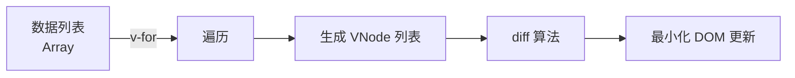
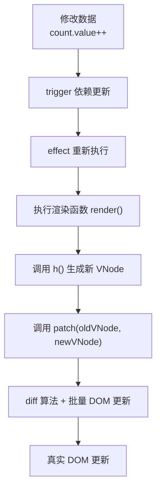

`runtime-dom` 是 Vue 3 源码中的一个核心包，它提供了**与浏览器 DOM 相关的运行时功能**。

除此以外，还包含了reactivity响应式系统、runtime-core 运行时核心（这个包含了组件、渲染器、虚拟DOM），我们的runtime-dom包含浏览器DOM的特定实现，比如DOM操作、事件和属性，complier-dom：浏览器模板编译器。

## 职责

通过runtime-dom我们可以创还能针对浏览器DOM的渲染器

```js
// runtime-dom 创建针对浏览器 DOM 的渲染器
const renderer = createRenderer({
  // 平台特定的节点操作
  createElement(type) {
    return document.createElement(type)
  },
  setElementText(node, text) {
    node.textContent = text
  },
  patchProp(el, key, prevValue, nextValue) {
    // 处理属性、事件、样式等
    if (key === 'class') { ... }
    else if (key === 'style') { ... }
    else if (isOn(key)) { ... } // 事件 @click
    else { ... }
  },
  // ... 其他 DOM 操作
})
```

它还负责导出浏览器专用的API：

```js
// 从 runtime-dom 导出的核心 API
export {
  createApp,        // 创建 Vue 应用
  render,           // 渲染函数
  h,                // 创建 VNode
  createElementVNode,
  // ... 其他
}
```

可以看出runtime-dom的职责就是DOM实现，是平台相关内容，就是负责补充DOM操作细节的。runtime-core的职责是浏览器的核心逻辑，是平台无关的，它负责虚拟DOM、组件系统。

```js
// runtime-core 中的渲染器基类
function createRenderer(nodeOps) {
  // 通用渲染逻辑
  function render(vnode, container) {
    // 调用 nodeOps 的方法操作平台特定节点
    nodeOps.insert(el, container)
  }
}

// runtime-dom 注入 DOM 操作实现
const renderer = createRenderer({
  insert: (el, parent) => parent.appendChild(el),
  remove: el => el.remove(),
  // ...
})
```

## vnode

我们熟悉的VNode实现在runtime-core中的，虚拟DOM属于平台无关的核心概念：

```ts
// packages/runtime-core/src/vnode.ts
export interface VNode<HostNode = any, HostElement = any> {
  type: any
  props: any
  key: string | number | symbol | null
  ref: any
  children: any
  component: ComponentInternalInstance | null
  el: HostNode | null
  // ... 其他属性
}

export function createVNode(type, props, children): VNode {
  // 创建 VNode 的逻辑
}
```

正因为如此，我们完全就可以在服务端使用VNode来生成HTML字符串，或者是小程序使用。

虚拟DOM就是为了在频繁的UI更新中，用js的计算成本来换取昂贵的DOM操作成本，因为真实的DOM操作涉及到了创建元素，修改属性、插入节点、删除等操作，开销都比较大，容易出发样式的重新计算、布局，DOM树重构，而且DOM对象本身也比较重，有大量属性和方法。

通过虚拟DOM我们就可以用js对象来描述真实DOM结构，这样玩法就比较大了，我们可以进行批量更新，将多次修改合成一次DOM操作，可以做到跨平台渲染，能够制作声明式UI描述UI长相，只更新变化部分，避免全量更新。

虚拟DOM操作是逃不开合并批量更新和diff算法自动处理的。diff和列表顺序变化是一起的，如果没有key，diff算法效率就会极低，甚至产生错误更新。

我们熟悉的v-for也是列表实现的，通过列表，可以数据驱动，自动更新，让diff算法自动处理，模板能够统一和保持一致。



### 组件工厂

VNode 和组件工厂（Component Factory）是**强耦合**的，我们可以根据组件工厂来生产VNode。


```js
// 组件定义
const MyComponent = {
  setup() {
    return () => h('div', 'Hello')
  }
}

// 创建 VNode 时，type 是组件对象
const vnode = h(MyComponent)
// vnode = {
//   type: MyComponent,  // ← 组件定义
//   props: {},
//   children: null,
//   component: null     // 渲染时会创建组件实例
// }
```

h()是vue的虚拟DOM创建方法，全称叫做createVNode，`h` 是它的简写。
`h()` 接收类型、属性、子节点三个参数，返回一个描述 UI 结构的 **JavaScript 对象**（VNode）。`h` 是 **hyperscript** 的缩写，意为“**描述 HTML 结构的 JavaScript 脚本**”，这个概念最早源于 React 的 `React.createElement`，Vue 沿用了这个命名

```js
// React 写法
React.createElement('div', { className: 'container' }, 'Hello')

// Vue 写法（更简洁）
h('div', { class: 'container' }, 'Hello')
```

```js
// 创建单个元素
h('div', { class: 'container' }, 'Hello Vue')

// 返回的 VNode 对象（简化）
{
  type: 'div',
  props: { class: 'container' },
  children: 'Hello Vue',
  // ... 其他内部属性
}
```

h()和模板是有直接关系的，如果你在template模板里写了，最后编译阶段会产生渲染函数，其中dom结构就是依靠h()表示。


```js
<!-- 模板写法 -->
<template>
  <div class="card">
    <h1>{{ title }}</h1>
    <p>{{ content }}</p>
  </div>
</template>

<!-- 编译后的渲染函数（简化） -->
<script>
export default {
  setup() {
    return () => h('div', { class: 'card' }, [
      h('h1', this.title),
      h('p', this.content)
    ])
  }
}
</script>
```

h()就是用于生产VNode的工具，而patch()就是用于消费VNode的工具，用于首次渲染。当有数据变化的时候，就会用h 生成新的VNode。

patch也在runtime-core中，位置在src/renderer.ts中，他就是渲染器的核心哈数，完全不依赖浏览器。对于我们之前的感知，当有数据变化的时候就会让触发器完成effect的重新执行才对，为什么会有新的vnode产生呢，似乎有点不一样。

因为数据变化让effect重新执行渲染函数的时候就会**重新调用h**！



