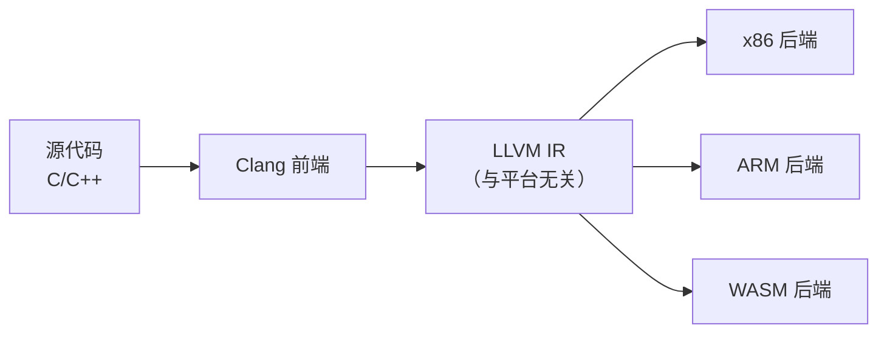

|概念|本质|核心职责|相互关系|
|---|---|---|---|
|**LLVM**|一套**模块化的编译器基础设施**和**工具链集合**[](https://llvm.googlesource.com/llvm-project/+/fde2aadb80020fe4a0fa887be5b6ca9d6df9564d)[](https://developer.aliyun.com/article/1637972)[](https://developer.baidu.com/article/detail.html?id=6878450)|提供一套**与具体语言和硬件无关的中间表示（IR）**，以及围绕它构建的**优化器、代码生成器**等后端工具[](https://developer.aliyun.com/article/1637972)[](https://developer.baidu.com/article/detail.html?id=6878450)。|为 Clang 等前端提供**后端支持**，是编译流程的下游。|
|**Clang**|是 LLVM 项目的一部分，一个**完整的编译器前端**[](https://www.ctyun.cn/developer/article/561824833167429)[](https://clang.llvm.net.cn/#blocks-in-protected-scope)[](https://zh.m.wikipedia.org/zh-my/Clang)|专门负责处理 **C、C++、Objective-C** 等语言[](https://clang.llvm.net.cn/#blocks-in-protected-scope)[](https://zh.m.wikipedia.org/zh-my/Clang)。它会将源代码进行词法、语法分析，最终生成 **LLVM IR**[](https://www.ctyun.cn/developer/article/561824833167429)[](https://cloud.tencent.com.cn/developer/article/1810976?policyId=1003)[](https://zh.m.wikipedia.org/zh-my/Clang)。|它依赖 **LLVM** 作为后端来生成最终的机器码[](https://www.ctyun.cn/developer/article/561824833167429)[](https://zh.m.wikipedia.org/zh-my/Clang)。|
|**GCC**|一套**完整的、独立的编译器集合**（GNU Compiler Collection）[](https://gcc.gnu.org/onlinedocs/gcc-4.9.1/gcc/G_002b_002b-and-GCC.html#index-C_002b_002b-14)[](https://hpc.chd.edu.cn/2019/1212/c9975a212763/page.htm)|它自带了多种语言的前端（如`g++` for C++）和**自己的后端**，能够直接将源代码编译成可执行文件[](https://raw.githubusercontent.com/enzohua/algo/9f9fb329faaf7098ea1f55b58404205226c6af75/Skill/C%2B%2B/1-%E5%9F%BA%E7%A1%80%E7%9F%A5%E8%AF%86/0-GCC.md)[](https://gcc.gnu.org/onlinedocs/gcc-4.9.1/gcc/G_002b_002b-and-GCC.html#index-C_002b_002b-14)[](https://hpc.chd.edu.cn/2019/1212/c9975a212763/page.htm)。|它是一个**独立的完整系统**，不依赖 LLVM/Clang。|

---

我们可以直接使用clang + llvm来 尝试同一个前端，为不同的后端生成代码：


```
# 同一个前端（Clang）可以为不同后端生成代码
clang -S -emit-llvm main.c -o main.ll    # 生成 LLVM IR（与平台无关）
clang -target x86_64-linux main.c        # 生成 x86_64 机器码
clang -target arm64-apple-darwin main.c  # 生成 ARM64 机器码
```

clang作为前端，本身是**不直接生成 x86 或 ARM 机器码，而是生成 LLVM IR；而 LLVM 后端则负责将这些 IR 转化为目标平台的机器码。**`clang` 命令之所以能直接输出可执行文件，是因为它**默认集成了 LLVM 后端**，并在背后自动完成整个编译流程，这一点要注意！




GCC包含了经典的三段式结构，能够负责理解源代码。GCC 内置了 C、C++、Go、Fortran 等多种语言前端[](https://android.googlesource.com/toolchain/gcc/+/430f43829fa42b459ccbb53b44843c54c8ba4550/gcc-4.8.3/gcc/doc/frontends.texi)[](https://gcc.gnu.org/onlinedocs/gcc-4.9.1/gcc/G_002b_002b-and-GCC.html#index-C_002b_002b-14)[](https://hpc.chd.edu.cn/2019/1212/c9975a212763/page.htm)。它对你的源代码进行语法、词法、语义分析，生成一种与语言相关的通用中间表示

中端来进行优化，负责与语言和平台无关的优化。它接收前端的 GENERIC，经过“gimplifier”处理，转化为更简单的 **GIMPLE** 形式，并进一步转换为 **SSA (Static Single Assignment)** 形式。所有与语言无关的核心优化（如死代码消除、内联等）都在这里完成。

后端生成目标平台机器码，它将优化后的 GIMPLE 转换为底层的 **RTL 形式，并进行寄存器分配、指令调度等平台相关的优化，最终生成具体的汇编代码，再交由汇编器 `as` 生成目标文件

GCC本身就是及核心，通常回合binutils二进制工具集，内含汇编器as、链接器ld等和glibc共同组成一个完整的GCC工具链，同于生成环境。我们在命令行里输入的gcc、g++，在gcc内部实际上是一个驱动程序，能够根据我们的参数，自动依次调用真正的编译器前端、优化器、后端和汇编器、链接器，最终输出我们想要的可执行文件。

