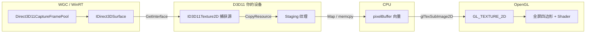

## GL

GLFW是一个专门针对OpenGL的C语言库，它提供了一些**渲染物体所需的最低限度的接口**。它允许用户创建OpenGL上下文、定义窗口参数以及处理用户输入，对我们来说这就够了。

这个可以让我们跳过windows的限制，直接向显卡驱动要绘图功能。我们需要先**从驱动里**查询字符串对应的内存地址：

```c++
	using GL_GENBUFFERS_PROC = void(*) (GLsizei, GLuint*);
	GL_GENBUFFERS_PROC glGenBuffers = reinterpret_cast<GL_GENBUFFERS_PROC>(wglGetProcAddress("glGenBuffers"));
```

把具名地址直接存进变量里，从此我们可以直接调用glGenBuffers，实际上就是跳转到显卡驱动提供的哪个地址去执行代码，wglGetProcAddress必须在OpenGL上下文创建之后才能成功，因为我们通过glfwCreateWindow和glfwMkaeContextCurrent，GLFW可以帮我们向显卡申请上下文。有了上下文，显卡驱动才可以激活，这个时候去加载函数地址，驱动才能给出响应。

这里的GLsizei是gl专门为尺寸和数量定义的int整数别名，在OpenGL世界里，为了保证代码在不同操作系统和显卡硬件都能有一致的表现，没有直接使用C++原生的int和float，而是定义了一套数据类型。

## GLAD

我们接下来要使用GLAD，这个是为了辅助GL开发而诞生的，因为显卡驱动会暴露成千上万个函数，比如说glGenBuffers等，还需要自己去手动方式编写using别名，强制转化等，一个一个查地址，很不方便，使用GLAD使用了一个庞大的头文件glad，可以让我们使用现代gl的所有的函数定义和全部加载逻辑，只需要调用一个初始化函数。

```c++
#include "logger.h"
#include <memory>
#include <GLFW/glfw3.h>
using namespace Logger;
void main() {
	//std::shared_ptr<LoggerClass> logger = std::make_shared<LoggerClass>( );
	//logger->Log(LoggerLevel::info, "test");

	glfwInit();
	glfwWindowHint(GLFW_CONTEXT_VERSION_MAJOR, 4);
	glfwWindowHint(GLFW_CONTEXT_VERSION_MINOR, 6);
	glfwWindowHint(GLFW_OPENGL_PROFILE, GLFW_OPENGL_CORE_PROFILE);

}
```

我们使用了glfwInit函数来**初始化GLFW**，然后我们可以**使用glfwWindowHint函数来配置GLFW**。glfwWindowHint函数的第一个参数代表**选项的名称**，我们可以从很多以`GLFW_`开头的枚举值中选择；第二个参数接受一个整型，用来设置这个选项的值，由于我们使用的是opengl 4.6w，因此可以这样设置。

然后我们告诉glfw我们使用的是核心模式，只是用opengel的一个子集，**我们创建一个窗口对象**，这个窗口对象**存放了所有和窗口相关的数据**，而且会被GLFW的其他函数频繁地用到。

```c++
	GLFWwindow* window =  glfwCreateWindow(800, 600, "Hello World", nullptr, nullptr);
	if (window == nullptr) {
		logger->Log(LoggerLevel::error, "Failed to create GLFW window");
		glfwTerminate();
	}
	glfwMakeContextCurrent(window); // 上下文
```

glfwCreateWindow函数需要窗口的宽和高作为它的前两个参数。第三个参数表示这个窗口的名称（标题）。最后两个参数我们暂时忽略。这个函数将会**返回一个GLFWwindow对象**，我们会在其它的GLFW操作中使用到。创建完窗口我们就可以**通知GLFW将我们窗口的上下文设置为当前线程的主上下文**了。

上下文包含了所有的内存，包括了顶点数据，以及加载的所有画图工具如着色器程序，我们当前的绘图状态。如果当前画笔是红色，以及是否开启了深度测试等。

之所以要把它设置为当前线程的主上下文是因为gl的函数是不带窗口参数的，比如，如果要修改一个窗口的背景色，你会这样写：window->SetBackgroundColor(Red)，但是gl中，改变背景色的代码是全局的，使用的是glClearColor(1.0f, 1.0f, 1.0f); 里面压根没有window。 所以**glfwMakeContexCurrent(window)就是将当前cpu线程发出的一切gl开头指令应用到window中去**。

我们必须告诉OpenGL渲染窗口的尺寸大小，即视口(Viewport)，这样OpenGL才只能知道怎样根据窗口大小显示数据和坐标。我们可以通过调用glViewport函数来设置视口的**尺寸**(Dimension)：

```c++
glViewport(0, 0, 800, 600);
```

glViewport函数前两个参数控制窗口左下角的位置。第三个和第四个参数控制渲染窗口的宽度和高度（像素）。实际上也可以**将视口的维度设置为比GLFW的维度小**，这样子之后**所有的OpenGL渲染将会在一个更小的窗口中显示**，这样子的话我们也可以将一些其它元素显示在OpenGL视口之外。

> OpenGL幕后**使用glViewport中定义的位置和宽高进行2D坐标的转换**，将OpenGL中的**位置坐标转换为你的屏幕坐标**。例如，OpenGL中的**坐标(-0.5, 0.5)有可能（最终）被映射为屏幕中的坐标(200,450)**。注意，处理过的OpenGL坐标范围只为-1到1，因此我们事实上**将(-1到1)范围内的坐标映射到(0, 800)和(0, 600)**。

**当用户改变窗口的大小的时候**，视口也应该被调整。我们可以对窗口注册一个回调函数(Callback Function)，它会在每次窗口大小被调整的时候被调用。这个回调函数的原型如下：

```c++
void framebuffer_size_callback(GLFWwindow* window, int width, int height);
```

然后主程序二这个函数，告诉glfw在窗口调整大小的时候调用这个函数：

```c++
glfwSetFramebufferSizeCallback(window, framebuffer_size_callback);
```

我们还可以将**我们的函数注册到其它很多的回调函数中**。比如说，我们可以**创建一个回调函数来处理手柄输入变化**，处理错误消息等。我们会在**创建窗口**之后，**渲染循环初始化之前注册这些回调函数**。

接下来我们需要使用渲染循环，让GLFW能够在推出前一直能保持运行下去，下面就是一个简单的渲染循环：

```c++
while(!glfwWindowShouldClose(window))
{
    glfwSwapBuffers(window);
    glfwPollEvents();    
}
```

- glfwWindowShouldClose函数在我们**每次循环的开始前检查一次GLFW是否被要求退出**，如果是的话，该函数返回`true`，渲染循环将停止运行，之后我们就可以关闭应用程序。
- glfwPollEvents函数**检查有没有触发什么事件**（比如键盘输入、鼠标移动等）、更新窗口状态，并调用对应的回调函数（可以通过回调方法手动设置）。
- glfwSwapBuffers函数会**交换颜色缓冲**（它是一个储存着**GLFW窗口每一个像素颜色值的大缓冲**），它在这一**迭代中被用来绘制**，并且将会作为输出显示在屏幕上。

这是个最简单的循环，用来**驱动渲染管线运行的外壳**，不过现在的循环是含有上一帧的残留，因此我们需要清理屏幕等操作。

我们可以通过调用glClear函数来清空屏幕的颜色缓冲，它接受一个**缓冲位(Buffer Bit)来指定要清空的缓冲**，可能的缓冲位有GL_COLOR_BUFFER_BIT，GL_DEPTH_BUFFER_BIT和GL_STENCIL_BUFFER_BIT。由于现在我们只关心颜色值，所以我们只清空颜色缓冲。

```c++
glClearColor(0.2f, 0.3f, 0.3f, 1.0f);
glClear(GL_COLOR_BUFFER_BIT);
```

注意，除了glClear之外，我们还**调用了glClearColor来设置清空屏幕所用的颜色**。当调用glClear函数，清除颜色缓冲之后，整个**颜色缓冲都会被填充为glClearColor里所设置的颜色**。在这里，我们将屏幕设置为了类似黑板的深蓝绿色。

记得在链接器的输入中加入opengl32.lib ，否则可能出现窗口闪退的情况，也就是缺少库文件的情况。

## 窗口焦点回调


在 GLFW 中，注册窗口焦点回调函数非常简单。你需要使用 `glfwSetWindowFocusCallback` 函数，回调函数的签名必须符合 GLFW 的要求：`void function_name(GLFWwindow* window, int focused)`。其中 `focused` 参数为 `GLFW_TRUE`（获得焦点）或 `GLFW_FALSE`（失去焦点）。

```c++
// 建议放在 main 函数之前，或者进行前置声明
void window_focus_callback(GLFWwindow* window, int focused)
{
    if (focused)
    {
        // 窗口获得焦点
        printf("Window gained focus\n");
    }
    else
    {
        // 窗口失去焦点
        printf("Window lost focus\n");
    }
}
```

你需要在创建窗口之后、进入 `while` 循环之前注册它：


```c++
// ... 窗口创建代码 ...
GLFWwindow* window = glfwCreateWindow(800, 600, "Hello World", nullptr, nullptr);

// 注册焦点回调
glfwSetWindowFocusCallback(window, window_focus_callback);

// ... 循环代码 ...
```


### win32的消息处理阻塞

鼠标在拖动窗口的时候，消息队列似乎没有从win32中读取消息，导致了窗口没有发生清理和重绘制，当你点击标题栏并开始拖动窗口时，Win32 的消息处理机制会进入一个**阻塞式的模态循环**。

原因是：在 Windows 底层，当你开始**拖动或调整窗口大小时**，系统会发送 `WM_ENTERSIZEMOVE` 消息。此时，`glfwPollEvents()` 内部调用的 Win32 `DispatchMessage` 会进入一个由操作系统接管的死循环。线程被阻塞在系统内部，直到你松开鼠标（发送 `WM_EXITSIZEMOVE`）。

解决也是有办法的，比如你可以使用定时器来强制重绘，Win32 提供了一个特性：即使在模态循环中，`WM_TIMER` 消息仍然会被处理。 **你可以通过 GLFW 获取底层的窗口句柄（HWND）**，并**设置一个低级别的 Win32 定时器**。

这里需要一些win32的基础知识，可以自己去学习和补充。
我们先写个刷新的回调函数方法：

```cpp
void static window_refresh_callback(GLFWwindow* window) {
    render_scene(window);
    glfwSwapBuffers(window); // 刷新回调里也建议手动 Swap 一下
    fmt::print(fg(fmt::color::blue) | fmt::emphasis::italic, "Window refreshed (Modal Loop)\n");
} 
```

这里也建议swap交换一下，是为了更好使用双缓冲机制，如果modal loop也就是在拖动、缩放的过程之中，主循环会被操作系统暂停，程序运行不到我们之前的swap代码。

### win32平台的解决方案

创建一个win32的回调函数，他实际上就是 `__stdcall宏`，如果不写的话，编译器默认使用 `__cdecl` 宏，可能导致32位的系统上的堆栈损坏，程序崩溃。

这两个你可以记住，它们规定的是函数调用的时候**参数的传递、清理堆栈的方法、函数编译后的长相**。 只要合理使用就能避免很多离奇的堆栈崩溃。

|**特性**|**__cdecl (C Declaration)**|**__stdcall (Standard Call)**|
|---|---|---|
|**参数入栈顺序**|从右向左 (Right-to-Left)|从右向左 (Right-to-Left)|
|**谁负责清理堆栈**|**调用者 (Caller)**|**被调用者 (Callee/函数自身)**|
|**变长参数支持**|**支持** (如 `printf`)|**不支持**|
|**常见用途**|C/C++ 程序的默认约定|**Win32 API**、导出 DLL 函数|
|**编译后名称修饰**|`_FunctionName`|`_FunctionName@X` (X 为参数字节数)|

```cpp
void CALLBACK TimerProc(HWND hwnd, UINT uMsg, UINT_PTR idEvent, DWORD dwTime) {
    if (g_window) {
        render_scene(g_window);
        glfwSwapBuffers(g_window);
    }
}
```
hwnd是我们的窗口句柄，uMsg是消息类型，对于我们的回调函数来说一直是WM_TIMER（0x0113），后期我会专门写一个win32相关的笔记。idEvent是UINT_PTR，是定时器的id，我们在后面使用SetTimer的第二个参数。 dwTime是DWORD类型，是系统时间，是系统启动以来经过的毫秒数，相当于GetTickCount方法，可以计算两帧之间的时间差。

如果说想要写一个节省消耗的版本，也就是失去窗口的焦点之后降低频率，可以使用：

```cpp
SetTimer(hwnd, 1, 16, (TIMERPROC)TimerProc); // ID为1，用于高频渲染
SetTimer(hwnd, 2, 100, (TIMERPROC)TimerProc); // ID为2，用于低频检查
```

这样，系统就会帮你在没过16ms的时候顺着TimerProc这个地址运行一边代码，因为windows内核里有一个专门负责计时的闹钟列表，时间到了之后就会向着程序发送一个WM_TIMER消息。

glfwPollEvent看到了消息之后，就会去执行回调函数，就是那个TimerProc函数。所以，当你**拖动窗口的时候，主循环里的render_scene暂停了**，但是消息循环没有停，这个时候DefWindowProc接管工作，在后台处理窗口移动消息。

我们的**glfwSetWindowRefreshCallback在注册了刷新回调的情况下，是一个事件驱动的机制**，当拖动窗口的时候，系统会**不停给程序发送WM_PAINT消息**，接管窗口的消息处理函数，收到消息的时候，检查有没有注册刷新回调，有的话就执行，**执行的频率是刚才定时器里定义的**。

还有很多其他情况也会发送WM_PAINT消息，可以粗略看一下：

- **从遮挡中恢复：** 比如你用浏览器挡住了你的 OpenGL 窗口，然后又把浏览器移开。被挡住的那部分区域现在“失效”了，系统会要求你重绘。
    
- **从最小化恢复：** 窗口从任务栏弹回桌面时，整个窗口区域都是无效的。
    
- **移动窗口（部分情况）：** 虽然现代 Windows (DWM) 会缓存窗口画面，但在某些配置下，移动窗口也会导致背景重绘。
    
- **手动触发（开发者最常用）：** 你在代码里调用了 `InvalidateRect` 或 `UpdateWindow`。

然后我们获取win32风格的窗口句柄：

```cpp
    // 获取 Win32 句柄并开启定时器
    HWND hwnd = glfwGetWin32Window(g_window);
    SetTimer(hwnd, 1, 16, (TIMERPROC)TimerProc); // 16ms 约等于 60fps，不要用 1ms（太占 CPU）
```

## WGC获取屏幕像素信息和显示

WGC是目前windows上最官方的屏幕捕捉方案，连我们最常用的OBS Studio也用的是这套API。WGC的底层是D3D11，他抓取到的屏幕画面是直接放在显卡的DX11纹理里面的，我们有个思路可以让WGC抓取屏幕之后拷贝到GL，作为GL纹理，渲染到窗口中，这涉及到了跨图形API操作。

由于WGC是一套现代的WINRT/COM API，如果要在传统CPP项目中使用，就需要使用C++/WinRT才行。我们可以在**NuGet包里安装**Microsoft.Windows.CppWinRT。我第一次看到也很奇怪，为啥cpp项目可以用nuget包，下面是解释。

在大家的印象里，NuGet 是 .NET 的专属“管家”，而 C++ 应该还在手动配置环境变量和 Lib 路径。NuGet 不仅仅是一个 DLL 管理器，它本质上是一个“**压缩包 + 逻辑注入**”工具。

当你为一个 C++ 项目安装 NuGet 包时，发生了以下三件事：

1. **下载与解压：** NuGet 把包（通常包含 `.h` 头文件、`.lib` 库文件和 `.dll`）下载到项目的 `packages` 文件夹。
    
2. **MSBuild 钩子（关键）：** 优秀的 C++ NuGet 包（比如 `cppwinrt`）内部包含 `.targets` 和 `.props` 文件。NuGet 会自动把这些文件“静默”地导入到你的 `.vcxproj` 项目文件中。
    
3. **自动化配置：** 这些 `.targets` 文件会告诉编译器：“嘿，去这个路径找头文件，去那个路径找库文件，顺便把这个 DLL 拷贝到输出目录。”

顺便一提，还有一个玩意儿叫做pywinrt，这个需要接触windows runtime也就是winrt。因为winrt本质是一个ABI，是一个应用二进制接口，使用一种叫做.winmd 全称 windows metadata的文件来描述自己的所有的类、方法、属性。C++/WINRT和C#/WINRT 都可以使用，前者把这些元素翻译为现代的CPP代码，后者是.net类型。 pywinrt则是翻译为Py模块，可以让我们在python里调用win11的原生功能，也就是我们刚才说的WGC屏幕抓取，低功耗蓝牙、系统通知等功能。 你可以使用pip install winrt-runtime来安装。

OKOK我们回到主线。我们安装之后可以引入对应的winrt包，然后重新编译一次，让它产生对应的文件夹。

```cpp
#pragma once
// com winrt
#include <winrt/base.h>
#include <unknwn.h>

// winrt投影文件
#include <winrt/Windows.Foundation.h>
#include <winrt/Windows.Graphics.Capture.h>
#include <winrt/Windows.Graphics.DirectX.Direct3D11.h>

// DirectX 11 原生接口
#include <d3d11.h>
#include <Windows.Graphics.DirectX.Direct3D11.interop.h>

// OpenGL 与窗口库
#include <glad/glad.h>
#define GLFW_INCLUDE_NONE
#include <GLFW/glfw3.h>
#define GLFW_EXPOSE_NATIVE_WIN32
#include <GLFW/glfw3native.h>
```

这里会有一个经典的头文件包含顺序冲突，windows开发中，windows.h或者是我们包含的unknwn.h  和 glfw3.h都尝试定义了APIENTRY这个宏，导致了冲突。因此我们可以调整包的包含顺序，将glfw3.h放在windows相关文件下方。

然后我们用COM指针创建一个d3d设备，然后建立数据管道，让WGC抓到的dx11纹理放入gl的纹理里面。这个属于cpu桥接模式，实现比较简单。



Windows.Graphics.Capture（WGC） 是按 WinRT/Direct3D 抽象设计的：帧池用 `IDirect3DDevice`，帧里是 `IDirect3DSurface`，底层仍然是D3D11纹理，要通过`CreateDirect3D11DeviceFromDXGIDevice` 把你创建的 `ID3D11Device`（经 `IDXGIDevice`） 包成 WinRT 能认的设备，才能 `Direct3D11CaptureFramePool::Create`、开始捕获。

当帧到达以后，`frame.Surface()` 是 WinRT 的 Direct3D 表面。  
要对 `ID3D11Device` / `ID3D11DeviceContext` 做 `CopyResource`，需要 `ID3D11Texture2D*`。
所以用 `IDirect3DDxgiInterfaceAccess::GetInterface(IID_ID3D11Texture2D)` 从表面取出底层的 `ID3D11Texture2D`——这是 WinRT 表面 → DXGI/D3D 原生指针 的标准Interop。

那么我们先初始化一下线程的COM/WINRT单元类型，这里是STA线程。单元室COM里面约定 **接口指针在哪个线程上被调用才合法** 的一套模型。老代码大多是单线程UI，还要和各种DLL里的对象互操作，于是就用单元来**规定对象的线程亲和性和消息派发方式**。比较常见的就是STA这个单线程单元和MTA多线程单元。前者是一个STA对应一个线程，比如说UI，这个线程需要消息泵，COM可能吧从另一个线程发来的调用通过消息排队返回到这个线程来执行。MTA是多个线程同时处于一个MTA中，对象可以默认被任意MTA线程直接用，没有STA那种排队到UI线程的保证，比较适合后台计算和线程池风格的服务码。

WPF是一种很典型很容易踩STA的地方，凡是UI单线程|消息泵的老派Windows桌面模型，通常都是要求UI线程在STA，还有winform，office/ie宿主里面的组件。ASP.NET里常见MTA，不带UI消息泵的后台、线程池、服务、部分服务器场景里很常见MTA。

然后创建一个D3D设备的COM指针，它用于创建纹理，和DXGI/WGC打交道。一个d3d设备上下文COM指针，它用于资源复制，可以将捕获的纹理放入staging，执行flush命令等，因为D3D11的执行模式是异步的，调用了CopyResource、Draw或者UpdateSubresource的时候，指令没有马上在显卡上，而是在命令缓冲区。由于默认行为，驱动程序会挤压指令，等到缓冲区满了之后遇到特定同步点时候全给GPU，但是flush可以直接全发给gpu。然后定义一个Staging纹理，因为捕获的帧对应的纹理是GPU默认堆，CPU不能直接读，因此我们要先CopyResource拷贝到staging再使用Map拷贝进入pixelBuffer。

因为D3D11/DGXI本身就是COM API，`ID3D11Device`、`ID3D11DeviceContext`、`IDXGIDevice` 等都不是普通 C++ 类，而是继承 `IUnknown` 的 COM 接口。所以指针类型天然的就是COM接口指针。

COM是一套约定，接口使用GUID标志，错误是HRESULT，对象创造、线程模型（STA/MTA）、注册表里面的CLSID/ProgID等。它包含的十分的广泛，包括了Windows自身里的shell、wmi、任务调度、加密、音频、大量的WINRT底层，都有COM接口，文档里有上千个接口，并且随着更新还在增加。DirectX/Media / Office等也是一大片COM，或者说COM风格的接口。第三方也可以实现自己的COM组件，数量无上限。那么这玩意咋学习，数量这么大！？

只需要明白通用的规则就行，比如IUnknown、HRESULT，什么时候QueryInterface，引用计数、com_ptr/comPtr用法、我们现在使用的D3D11、WINRT捕获就只使用了ID3D11、IDXGI、WGC相关的接口打交道。我们完全可以**在MSDN按接口查找**，而不需要去学习整个COM体系。后面如果有时间我也会去写一个文档。

### 搭桥连接WINRT和D3D


```cpp
    winrt::init_apartment();


    winrt::com_ptr<ID3D11Device> d3dDevice;

    winrt::com_ptr<ID3D11DeviceContext> d3dContext;

    winrt::com_ptr<ID3D11Texture2D> stagingTexture;

  
    std::mutex bufferMutex;

    std::vector<uint8_t> pixelBuffer;

    std::atomic<bool> frameDirty{ false };
```

后面的三个，bufferMutex是一个互斥锁，用于保护pixelBuffer来执行捕获回调线程，主线程会使用pixelBuffer做glTexSubImage2D来防止一边写一边读造成的数据错乱和未定义行为。

pixelBuffer就是我们在CPU上的像素缓存，是D3D读取完之后，交给GL之前的公用缓冲区，后面使用glTexSubImage2D把它放在GL纹理。

**frameDirty是脏标志**，当新的帧进入了pixelBuffer的时候，捕获回调里拷贝完缓冲后置true，主循环里上传纹理后置false。之所以用atomic是为了无锁判断，减轻锁竞争，真正读取像素数据的时候配合上面那个互斥锁，保证写入不重叠。

然后我们使用**D3D11CreateDevice** 来创建**D3D11设备和立即上下文**。
```cpp
    HRESULT hr = D3D11CreateDevice(
        nullptr,                    // 1. pAdapter (使用默认适配器)
        D3D_DRIVER_TYPE_HARDWARE,   // 2. DriverType
        nullptr,                    // 3. Software
        D3D11_CREATE_DEVICE_BGRA_SUPPORT, // 4. Flags (WGC 必须)
        nullptr,                    // 5. pFeatureLevels
        0,                          // 6. FeatureLevels
        D3D11_SDK_VERSION,          // 7. SDKVersion
        d3dDevice.put(),            // 8. ppDevice
        nullptr,                    // 9. pFeatureLevel (容易漏掉这个!)
        d3dContext.put()            // 10. ppImmediateContext
    );
```
这是 Direct3D 11 的核心函数，创建 D3D11 设备和上下文。

|参数|值|含义|
|---|---|---|
|第1个|`nullptr`|使用默认显示适配器（显卡）|
|第2个|`D3D_DRIVER_TYPE_HARDWARE`|使用硬件加速渲染（GPU）|
|第3个|`nullptr`|不使用软件回退设备|
|第4个|`D3D11_CREATE_DEVICE_BGRA_SUPPORT`|创建设备时支持 **BGRA** 格式（屏幕截图常用格式）|
|第5个|`nullptr`|不指定功能级别列表（使用默认）|
|第6个|`0`|功能级别列表长度（0 表示使用默认）|
|第7个|`D3D11_SDK_VERSION`|SDK 版本常量|
|第8个|`pImpl->d3dDevice.put()`|输出参数：接收创建的 **D3D11 设备**|
|第9个|`nullptr`|不需要设备特性级别|
|第10个|`pImpl->d3dContext.put()`|输出参数：接收创建的 **D3D11 设备上下文**（命令队列）|

**关于 `.put()`**：在 `winrt::com_ptr` 中，`put()` 返回指针的地址，用于接收 COM 对象。

我们为了让多个线程安全公用一个`ID3D11DeviceContext`，而不破坏 D3D11 内部状态，我们需要一个同步锁。
```cpp
    auto multithread = d3dDevice.as<::ID3D11Multithread>();
    multithread->SetMultithreadProtected(TRUE);
```
这个会和上面的bufferMutex一起出现。

之后我们需要吧已经建好的原生ID3D11Device变成WinRT里面的`Windows::Graphics::DirectX::Direct3D11::IDirect3DDevice`，这样后面的 Windows.Graphics.Capture（帧池等）才能接受「用哪块 GPU / 哪个 D3D 设备来捕获」。


```cpp
  winrt::com_ptr<::IInspectable> inspectable;
 winrt::com_ptr<IDXGIDevice> dxgiDevice = d3dDevice.as<IDXGIDevice>();
```
`ID3D11Device` 实现了 `IDXGIDevice`（ DXGI 设备接口）。  `as<>` 等价于 `QueryInterface`：从 D3D11 设备指针拿到 `IDXGIDevice*`。  WinRT 侧要从「DXGI 认识的设备」搭桥，所以需要这一层。由于winrt里面几乎所有可调用的运行时对象底层都有`IInspectable`（在 **`IUnknown` 之上多了元数据/接口查询能力）。  
互操作函数 `CreateDirect3D11DeviceFromDXGIDevice` 的签名要求输出 `IInspectable*`，意思是：先给你一个「泛型 WinRT 对象引用」，还没说是 `IDirect3DDevice` 还是别的抽象。 

在下面我们就会使用他。

```cpp
CreateDirect3D11DeviceFromDXGIDevice(dxgiDevice.get(), inspectable.put())
```

这是 `windows.graphics.directx.direct3d11.interop.h` 里的 **互操作函数**：

- 输入：原生 `IDXGIDevice`（你的 GPU 设备在 DXGI 里的代表）。
- 输出：`IInspectable*` —— WinRT 里万物皆可先当成 `IInspectable`，相当于「WinRT 对象的核心 COM 指针」。

之后我们会用`IInspectable::QueryInterface`（WinRT 里写成 `as<IDirect3DDevice>()`）换成具体的 `IDirect3DDevice` 投影类型。这里就是之前说的D3D WINRT抽象，同一个底层设备，在WINRT API 里参数类型是IDirect3DDevice，但是不能直接塞入ID3D11Device*。

WGC是不认裸的 ID3DDevice* 的，它只会辨认IDirect3DDevice，所以必须通过CreateDirect3D11Device做官方规定的转换。

```cpp
    auto winrtDevice = inspectable.as<winrt::Windows::Graphics::DirectX::Direct3D11::IDirect3DDevice>();
```

### 捕获屏幕

我们需要拿到一个GraphicsCaptureItem表示捕获哪一块屏幕，这里选的是整块与桌面窗口关联的显示器。后面 `Direct3D11CaptureFramePool` / `CreateCaptureSession` 都要基于这个 `item`。


```cpp
HMONITOR hMonitor = MonitorFromWindow(GetDesktopWindow(), MONITOR_DEFAULTTONEAREST);
```
- `GetDesktopWindow()`：桌面（Shell）那个顶层窗口的句柄，用来当「锚点」。
- `MonitorFromWindow(..., MONITOR_DEFAULTTONEAREST)`：根据这个窗口，解析出它所在的 **显示器句柄** `HMONITOR`（哪一块物理屏）。也就是说：先锁定「桌面在哪块显示器上」，得到 Win32 的显示器标识。


由于桌面捕获走的是COM互操作的扩展，我们需要拿到做互操作的工厂来调用`CreateForMonitor` / `CreateForWindow` 这类 非纯 WinRT 的入口。互操作就是两套互相不认识的技术栈能够互相调用、交换指针来表示同一种东西，让他们一起工作。因为Windows种很多东西是分层、分年代做出来的，比如win32以他为代表的HWND、HMONITOR、消息循环。WINRT为代表的IInspectable、异步、GraphicsCaptureItem。

```cpp
    auto interop_factory = winrt::get_activation_factory<winrt::Windows::Graphics::Capture::GraphicsCaptureItem, IGraphicsCaptureItemInterop>();
    winrt::Windows::Graphics::Capture::GraphicsCaptureItem item{ nullptr };
    // hmonitor 是显示器的句柄，item 就是我们要捕获的目标了
    winrt::check_hresult(interop_factory->CreateForMonitor(hMonitor,
      winrt::guid_of<ABI::Windows::Graphics::Capture::IGraphicsCaptureItem>(),
        winrt::put_abi(item)));
    // 获取分辨率
```

有了item，我们才能读取分辨率、缓冲大小，才能使用framePool.CreateCaptureSession(item)来录制这一个源。我们通过IGraphicsCaptureItemInterop来构建WINRT的GraphicsCaptureItem，把录制的源定下来。

显示器的win32句柄是HMONITOR，item是winrt的捕获源对象，内部有这个屏幕相关的信息，对外是捕获api使用的一项。

接下来我们要去**初始化staging纹理**，规定item的尺寸，分配CPU的pixelBuffer和一块可读的staging纹理，格式BGRA8，专门把GPU上的**捕获结果给中转成CPU可读字节**。

```cpp
    auto itemSize = item.Size();
    pixelBuffer.resize(itemSize.Width * itemSize.Height * 4); // 4 字节一个像素 (BGRA8
    // 初始化staging texture
    D3D11_TEXTURE2D_DESC desc = {};
    desc.Width = itemSize.Width;
    desc.Height = itemSize.Height;
    desc.MipLevels = 1; // 不需要 mipmap
    desc.ArraySize = 1;
    desc.Format = DXGI_FORMAT_B8G8R8A8_UNORM; // WGC 要求的像素格式
    desc.SampleDesc.Count = 1; // 不需要多重采样
    desc.Usage = D3D11_USAGE_STAGING; // staging 纹理才能被 CPU 访问，中转模式
    desc.CPUAccessFlags = D3D11_CPU_ACCESS_READ; // 只需要读权限
    desc.BindFlags = 0; // staging 纹理不能绑定到管线
    hr = d3dDevice->CreateTexture2D(&desc, nullptr, stagingTexture.put());
```

### 建立帧池和捕获


```cpp
    auto framePool = winrt_capture::Direct3D11CaptureFramePool::CreateFreeThreaded(
        winrtDevice,
        DirectXPixelFormat::B8G8R8A8UIntNormalized, // WGC 要求的像素格式
        2, // 帧池里缓冲的帧数，至少要 2 帧以上才能保证不卡顿
        itemSize
    );
```
我们创建 `Direct3D11CaptureFramePool`：向 Windows 桌面捕获要一块「Direct3D11 纹理环形缓冲」，系统会把捕获到的帧放进池里，再在 `FrameArrived` 里 `TryGetNextFrame` 取出来。

`CreateFreeThreaded` 表示：**池可以在任意线程向你的回调投递帧**（适合后台处理）；若用**非 FreeThreaded 版本**，通常要把**投递和消费对齐到创建帧池时的线程**（多是 UI 线程）。

device是WINRT的IDirect3DDevice，和前面的CreateDirect3DDeviceFromDXGIDevice出来的是同一个逻辑设备，帧池里面的GPU纹理都在这套D3D11设备上分配，和我们的D3DDevice/stagingTexture要能拷贝。

WinRT 枚举里的 BGRA 每通道 8 位、归一化，对应 DXGI `DXGI_FORMAT_B8G8R8A8_UNORM`，和 staging、`pixelBuffer`、`glTexSubImage2D(GL_BGRA)` 一致。

帧池里 同时存在的缓冲个数（至少 2 很常见）：生产者（系统捕获）和消费者（你读帧）可以 流水线，避免总是互相卡住；太小容易拖尾或阻塞，太大占显存。注释里说「至少 2」是经验说法，**2 是常用默认值**。

向帧池注册有新的帧可用的是使用的回调函数：

```cpp
// 然后注册回调

    framePool.FrameArrived([&](auto&& pool, auto&&)

        {
            try {
                auto frame = pool.TryGetNextFrame();
                if (!frame) return;
                auto surface = frame.Surface();
                auto access = surface.as<IDirect3DDxgiInterfaceAccess>();

                // 直接从这个接口里提取出 ID3D11Texture2D
                winrt::com_ptr<ID3D11Texture2D> sourceTexture;
                winrt::check_hresult(access->GetInterface(__uuidof(ID3D11Texture2D), sourceTexture.put_void()));
                if (sourceTexture)
                {
                    // 显存拷贝
                    d3dContext->CopyResource(stagingTexture.get(), sourceTexture.get());
                    d3dContext->Flush(); // 强制提交 GPU 指令
                    D3D11_MAPPED_SUBRESOURCE mapped;
                    if (SUCCEEDED(d3dContext->Map(stagingTexture.get(), 0, D3D11_MAP_READ, 0, &mapped)))
                    {
                        {
                            std::lock_guard<std::mutex> lock(bufferMutex);
                            uint8_t* src = static_cast<uint8_t*>(mapped.pData);
                            uint8_t* dst = pixelBuffer.data();
                            auto size = frame.ContentSize();
                            size_t widthInBytes = size.Width * 4;
                            for (int y = 0; y < size.Height; ++y) {
                                memcpy(dst + (y * widthInBytes), src + (y * mapped.RowPitch), widthInBytes);

  

                                // 依然强行填充 Alpha，防止黑色背景导致不可见
                                for (int x = 0; x < size.Width; ++x) {
                                    dst[y * widthInBytes + x * 4 + 3] = 255;
                                }
                            }
                        }

                        d3dContext->Unmap(stagingTexture.get(), 0);
                        frameDirty.store(true);

  

                        // 打印调试

                        static int debugC = 0;
                        if (++debugC % 60 == 0) {
                            fmt::print("Success! Pixel 0 color: B={}, G={}, R={}, A={}\n",
                                pixelBuffer[0], pixelBuffer[1], pixelBuffer[2], pixelBuffer[3]);

                        }
                    }
                }
            }
            catch (winrt::hresult_error const& ex) {
                fmt::print(fg(fmt::color::red), "Interop Error: {}\n", winrt::to_string(ex.message()));
            }
        });
```
我们每取到一个帧，就去获取它的winrt表面frame.Surface，这个是IDirect3DSurface的winrt抽象。通过`surface.as<IDirect3DDxgiInterfaceAccess>()` → `GetInterface(ID3D11Texture2D)`拿到D3D纹理，interop把winrt表面换成了ID3D11Texture2D*，才能走D3D API。 使用GPU拷贝将捕获的纹理拷贝到staging:

```cpp
                    // 显存拷贝
                    d3dContext->CopyResource(stagingTexture.get(), sourceTexture.get());
                    d3dContext->Flush(); // 强制提交 GPU 指令
```


我们使用CPU读取，staging是可以被cpu映射的，使用mapped.Pdata + RowPitch按行访问。 我们使用memcpy循环+lock上锁把像素拷贝进入pixelBuffer，与主线程glTexSubImage2D共享，所以加锁。

```cpp
if (SUCCEEDED(d3dContext->Map(stagingTexture.get(), 0, D3D11_MAP_READ, 0, &mapped)))
                    {
                        {
                            std::lock_guard<std::mutex> lock(bufferMutex);
                            uint8_t* src = static_cast<uint8_t*>(mapped.pData);
                            uint8_t* dst = pixelBuffer.data();
                            auto size = frame.ContentSize();
                            size_t widthInBytes = size.Width * 4;
                            for (int y = 0; y < size.Height; ++y) {
                                memcpy(dst + (y * widthInBytes), src + (y * mapped.RowPitch), widthInBytes);
                            }
                        }
                        d3dContext->Unmap(stagingTexture.get(), 0);
                        frameDirty.store(true);
                        }
                    }
```

memcpy的dst是起始的地址，表示写到哪里去。src是源起始地址，表示写到哪里去。count是拷贝的字节数。

使用Unmap解锁，配对的Map必须这么做。并且用脏标记通知渲染 frameDirty = true。

一切做好了之后我们可以创建帧池的会话并且开始捕获了。

```cpp
    auto session = framePool.CreateCaptureSession(item);

    session.StartCapture();
```

系统会开始向framePool投递帧，FrameArrived回调会开始触发并工作。由于D3D和GL的坐标系不一样，GL是左下角开始，y轴朝上，而D3D是左上角开始，y轴朝下。我们需要使用着色器翻转一下。或者不管怎么说，你始终都要用着色器，因为用的是gl。


```cpp
    //着色器绘制矩形

    const char* vertexShaderSource = R"(

    #version 460 core

    layout (location = 0) in vec2 aPos;

    layout (location = 1) in vec2 aTexCoords;

    out vec2 TexCoords;

    void main() {

        gl_Position = vec4(aPos, 0.0, 1.0);

        // 翻转 Y 轴：1.0 - y

        TexCoords = vec2(aTexCoords.x, 1.0 - aTexCoords.y);

    }

)";

  

    const char* fragmentShaderSource = R"(

    #version 460 core

    out vec4 FragColor;

    in vec2 TexCoords;

    uniform sampler2D screenTexture;

    void main() {

        vec4 sampledColor = texture(screenTexture, TexCoords);

        // 关键：只取 RGB，Alpha 强行设为 1.0

        FragColor = vec4(sampledColor.rgb, 1.0);

    }

)";
```
这里我们编写一个顶点着色器，一个片段着色器。使用编译和链接着色器的辅助函数：

```cpp
// 编译单个着色器的辅助函数

GLuint compileShader(GLenum type, const char* source) {
    GLuint shader = glCreateShader(type);
    glShaderSource(shader, 1, &source, nullptr);
    glCompileShader(shader);
    // 检查编译是否成功
    int success;
    char infoLog[512];
    glGetShaderiv(shader, GL_COMPILE_STATUS, &success);
    if (!success) {
        glGetShaderInfoLog(shader, 512, nullptr, infoLog);
        // 这里用了你代码里的 logger，如果没有就改用 printf
        fmt::print(fg(fmt::color::red), "ERROR::SHADER::COMPILATION_FAILED\n{}\n", infoLog);
    }
    return shader;
}

// 链接着色器程序的辅助函数

GLuint createShaderProgram(const char* vShaderCode, const char* fShaderCode) {
    GLuint vertex = compileShader(GL_VERTEX_SHADER, vShaderCode);
    GLuint fragment = compileShader(GL_FRAGMENT_SHADER, fShaderCode);
    GLuint program = glCreateProgram();
    glAttachShader(program, vertex);
    glAttachShader(program, fragment);
    glLinkProgram(program);
    // 检查链接是否成功
    int success;
    char infoLog[512];
    glGetProgramiv(program, GL_LINK_STATUS, &success);
    if (!success) {
        glGetProgramInfoLog(program, 512, nullptr, infoLog);
        fmt::print(fg(fmt::color::red), "ERROR::SHADER::PROGRAM::LINKING_FAILED\n{}\n", infoLog);
    }
    // 链接完就可以删掉中间件了
    glDeleteShader(vertex);
    glDeleteShader(fragment);
    return program;

}
```
编写绘制方法就可以绘制了：

```cpp
struct AppRenderState {
    GLFWwindow* window{};
    GLuint shaderProgram{};
    GLuint VAO{};
    GLuint texture{};
    GLint screenTextureLoc{};
    std::mutex* bufferMutex{};
    std::vector<uint8_t>* pixelBuffer{};
    std::atomic<bool>* frameDirty{};
    int texWidth{};
    int texHeight{};
    bool ready{};
};

  

static AppRenderState g_render;
void static processInput(GLFWwindow* window);
static void draw_present_frame(AppRenderState& s) {

    if (!s.ready || !s.window)
        return;
    glfwMakeContextCurrent(s.window);

    if (s.frameDirty->load()) {
        std::lock_guard<std::mutex> lock(*s.bufferMutex);
        glBindTexture(GL_TEXTURE_2D, s.texture);
        glPixelStorei(GL_UNPACK_ALIGNMENT, 4);
        glTexSubImage2D(GL_TEXTURE_2D, 0, 0, 0, s.texWidth, s.texHeight,
            GL_BGRA, GL_UNSIGNED_BYTE, s.pixelBuffer->data());
        s.frameDirty->store(false);
    }

  

    glClearColor(0.1f, 0.1f, 0.1f, 1.0f);
    glClear(GL_COLOR_BUFFER_BIT);
    glUseProgram(s.shaderProgram);
    glUniform1i(s.screenTextureLoc, 0);
    glActiveTexture(GL_TEXTURE0);
    glBindTexture(GL_TEXTURE_2D, s.texture);
    glBindVertexArray(s.VAO);
    glDrawArrays(GL_TRIANGLES, 0, 6);
    glfwSwapBuffers(s.window);
}
```

