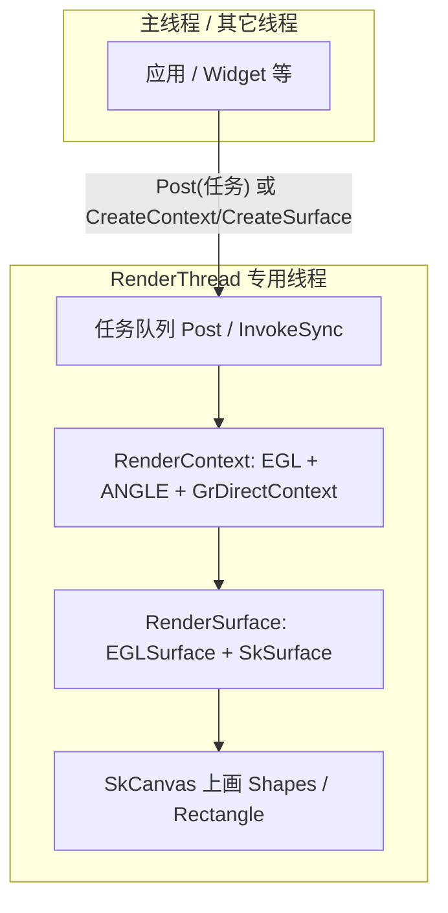

如果先不管窗口管理的具体逻辑，我们先聚焦于绘制这个任务上面来。

渲染线程是一个单线程+队列的形式，所有 EGL / 当前上下文 / 创建 `RenderContext`·`RenderSurface` 都应在这条线程上完成（或通过 `Post` / `InvokeSync` 投递过去）。

并且，我们需要一个和GPU绘画的资源，那就是EGL，经 ANGLE，Windows 上走 D3D11）+ Skia 的 `GrDirectContext`。

GLFW的窗口句柄绑定到EGL的surface后，使用sksurface-》 skcanvas，负责一帧的绘制。