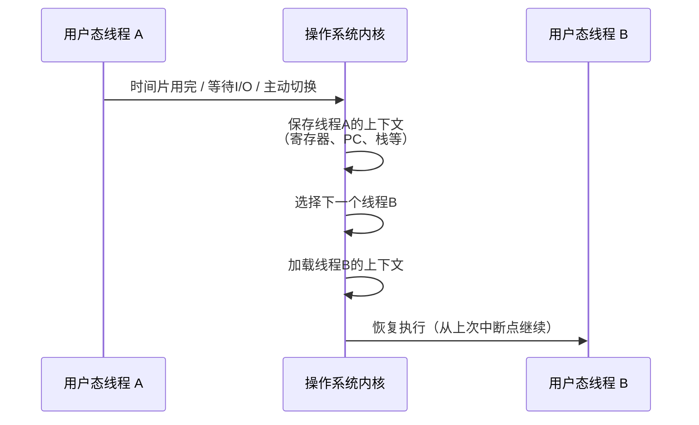
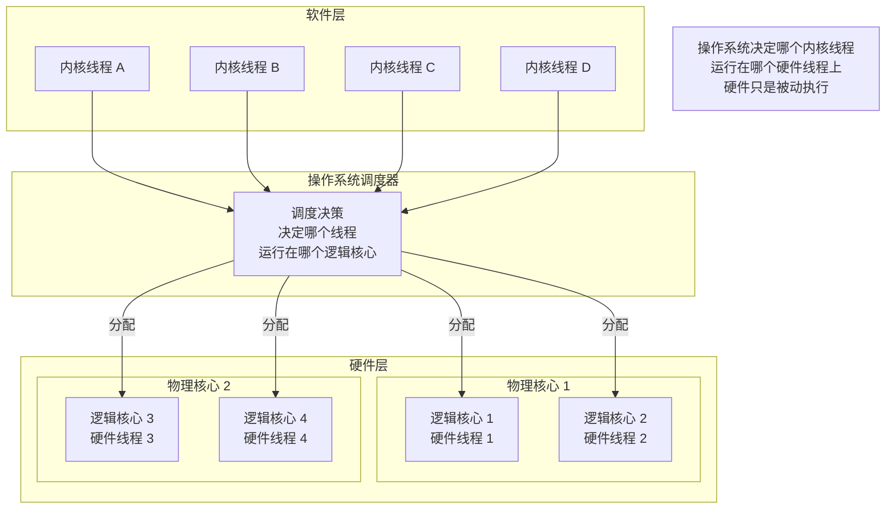
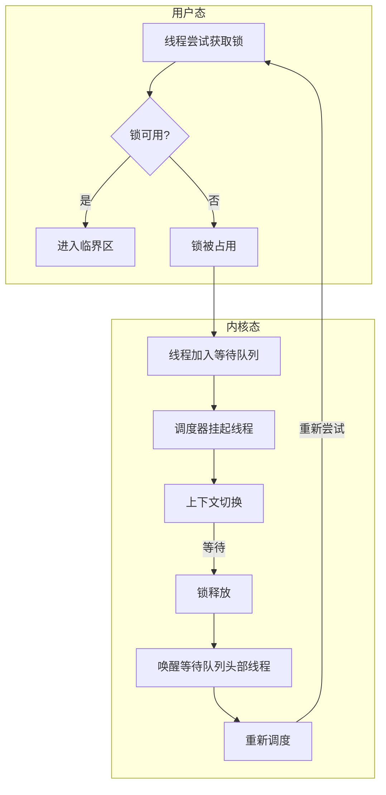
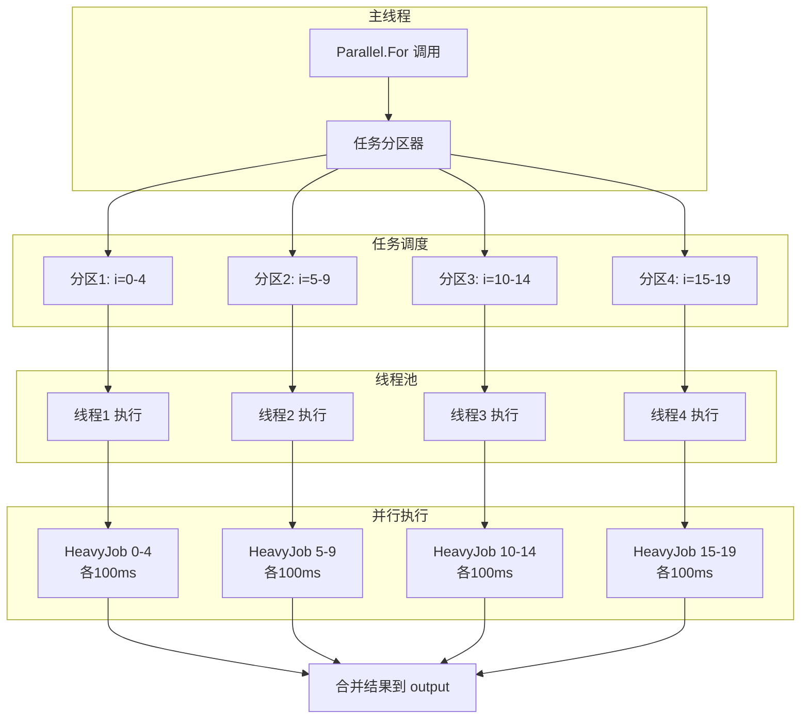
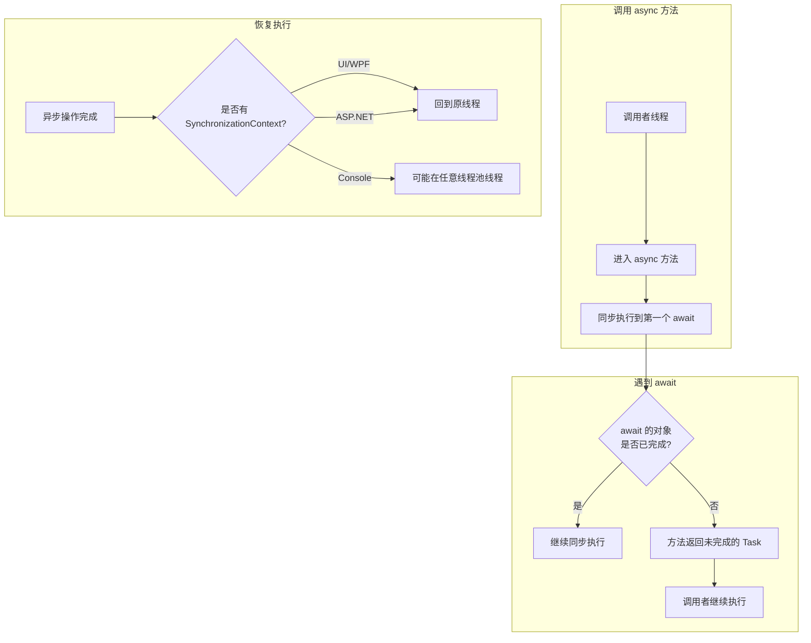

## 基础知识

线程上下文：是操作系统内核为每个线程维护的一个数据结构，记录了线程**暂停执行时**的完整状态。当**操作系统决定切换正在运行的线程时**，它必须保存当前线程的上下文，并加载下一个线程的上下文——这个过程称为**上下文切换（Context Switch）**。

包含内容：

| 类别             | 内容                       | 作用                 |
| -------------- | ------------------------ | ------------------ |
| **CPU 寄存器**    | 程序计数器（PC）、栈指针（SP）、通用寄存器等 | 决定线程“从哪里继续执行”      |
| **内核栈**        | 线程在内核态执行时的**调用栈**        | 存储系统调用、**中断处理**的信息 |
| **线程环境块（TEB）** | 线程**局部存储**（TLS）、异常处理链等   | 记录线程特有的数据          |
| **安全上下文**      | 访问令牌、权限信息                | 决定线程能访问哪些资源        |
| **浮点/向量寄存器**   | SSE、AVX 等寄存器状态           | 支持浮点运算和 SIMD 指令    |
线程上下文是操作系统级别的，每个线程都有自己的上下文。

上下文切换发生在时间片耗尽、阻塞、优先级抢占、显式让出等情况。




在Windows上，一次线程上下文切换需要 **几百纳秒到几微秒**，但如果**涉及跨进程切换**，开销会更大。其代价主要来自：

|开销来源|说明|
|---|---|
|**模式切换**|从用户态切换到内核态（反之亦然），涉及权限检查和栈切换|
|**寄存器保存/恢复**|需要保存/加载几十个寄存器的值|
|**TLB 刷新**|切换到不同进程时，CPU 的地址转换缓存（TLB）会失效，导致后续内存访问变慢|
|**CPU 缓存污染**|新线程的代码和数据会挤掉旧线程的缓存内容|
|**调度器决策**|操作系统需要运行调度算法决定下一个运行哪个线程|

## 代码相关

### 原子操作和锁

硬件层面的线程和软件层面的线程：




CPU亲和性：是指**线程是否倾向于（或被强制）在同一个 CPU 核心上反复运行**，这个主要是为了更加合理的使用CPU的多级缓存性质。每个核心有自己的 L1/L2 缓存：

```c
// 当线程在核心1上运行时
线程访问数据 → 数据加载到核心1的 L1/L2 缓存

// 如果线程切换到核心2
数据不在核心2的缓存中 → 缓存未命中（Cache Miss）
需要从 L3 或内存重新加载 → 延迟增加 10-100 倍
```
线程频繁迁移会导致**缓存未命中率飙升**，**那些被高频访问、并且访问模式呈现强局部性的数据**，从亲和性中获益最大。如果一个数据只被一个线程给访问的话，可以完全驻留在该核心的 L1/L2 缓存中。

```cs
// 场景：每个线程维护自己的计数器
class PerThreadData
{
    // 线程局部存储（TLS）
    [ThreadStatic]
    private static long _requestCount;
    
    [ThreadStatic]
    private static long _cacheHitCount;
    
    public static void ProcessRequest()
    {
        // 这些变量完全驻留在当前核心的缓存中
        // 绑定核心后，L1/L2 命中率接近 100%
        _requestCount++;
        
        if (IsCacheHit())
            _cacheHitCount++;
        
        // 计算命中率
        double hitRate = (double)_cacheHitCount / _requestCount;
    }
}
```

这种模式我们可以从其他的应用中得到启发，典型的就是Redis6.0之前，虽然它是单线程，但是它的性能很强，主要就是因为redis使用饿了单线程的事件循环，核心数据完全绑定在一个核心上，获得了极高的缓存命中率。多线程版本虽然提高了吞吐，但引入了更多的缓存一致性开销。

这里是判断是否需要亲和性的方法：

|问题|是|否|
|---|---|---|
|数据被单一线程独占访问？|✅ 强烈建议|考虑 Per-CPU 拆分|
|访问频率 > 10万次/秒？|✅ 建议|收益不明显|
|数据大小 < L2 缓存（256KB）？|✅ 可完全缓存|可能溢出到 L3|
|多线程高频写入同一缓存行？|⚠️ 应避免|考虑缓存行对齐|
|只是偶尔读取的配置数据？|❌ 不需要|无收益|


我们在.NET中可以设置线程的亲和性：

```cs
using System.Diagnostics;
using System.Runtime.InteropServices;

// Windows 上的线程亲和性设置
public static void SetThreadAffinity(int coreIndex)
{
    var process = Process.GetCurrentProcess();
    var thread = Process.GetCurrentProcess().Threads[0];
    
    // 设置线程的亲和性掩码（第 coreIndex 位为 1）
    var affinityMask = (IntPtr)(1L << coreIndex);
    thread.ProcessorAffinity = affinityMask;
}
```


我们需要了解锁在系统内核中的原生形态，常见的锁以及锁不可用的时候，等待线程的行为模式。
互斥锁的实现是 **线程阻塞和唤醒** ：


因此一个核心如果其中的线程在运行的时候，进不去临界区，就会进入休眠，然后内核调用上下文切换进执行其他线程的任务，这个是比较基础的单核CPU的模型，这个调度的目的也是为了防止CPU空转。

自旋锁是一种线程同步机制，当线程**尝试获取已被占用的锁时**，它不会进入休眠状态，而是在一个循环中**不断检查**锁是否可用——这个过程称为"自旋"。
和互斥不同，互斥如果锁不可用就会去进入等待队列，但是自旋如果不可用就会循环检查锁状态。但最重要的是，自旋的时候会一直消耗着CPU，会一直保持着用户态，不会出现陷入内核态的情况。因此没有用户态切换延迟！

```cs
public struct SimpleSpinLock
{
    private int _lock;  // 0 = 空闲, 1 = 占用
    
    public void Enter()
    {
        // 自旋：不断尝试获取锁
        while (Interlocked.CompareExchange(ref _lock, 1, 0) != 0)
        {
            // 锁被占用，继续循环等待
            // 可选：短暂停顿，避免过度消耗CPU
            Thread.SpinWait(10);
        }
    }
    
    public void Exit()
    {
        // 原子释放锁
        Interlocked.Exchange(ref _lock, 0);
    }
}

// 使用示例
SimpleSpinLock spinLock = new SimpleSpinLock();
spinLock.Enter();
try
{
    // 临界区代码（必须极短）
    counter++;
}
finally
{
    spinLock.Exit();
}
```


我们知道C#提供了移交叫做Interlocked的类，他可以帮助我们实现cpu的原子操作。

>[!tip] 💡 **对比**：`Interlocked.Increment` 使用的 `lock` 前缀指令**完全在用户态执行**，不涉及模式切换，所以只需要 **几个纳秒** 到几十个纳秒——比上下文切换快 1~2 个数量级。

这个比使用lock和上锁的用户态自旋的方式来说快了好几倍。顺便提一嘴，自旋指的是单核CPU上持有锁的线程被抢占，**自旋的线程永远等不到锁，只会浪费整个时间片**。或者是多核 CPU 上，自旋的线程可以在**另一个核心**上运行，等待持有锁的核心释放锁。

C#中有个叫做Paraller的类，`Parallel.For` 的作用是**并行执行循环迭代**，将函数分配到多个线程上同时执行。

```cs
// 串行版本：顺序执行，总耗时 = 20 × 100ms = 2000ms
for(int i = 0; i < input.Length; i++)
{
    output[i] = HeavyJob(input[i]);  // 每次等待100ms
}

// 并行版本：20个任务同时执行，总耗时 ≈ 100ms（取决于CPU核心数）
Parallel.For(0, input.Length, i => output[i] = HeavyJob(input[i]));
```

下面是Parallel.For的工作原理：




// Parallel.For 使用 .NET 线程池，不会每次都创建新线程
// 线程池会根据 CPU 核心数和任务负载动态调整线程数

另一种方式是使用PLINQ，PLINQ 是 LINQ 的并行版本，通过 `.AsParallel()` 将查询转换为**并行执行**，自动将数据分区到多个线程上处理，通过 `.AsParallel()` 将查询转换为**并行执行**，自动将数据分区到多个线程上处理。


```cs
var input = Enumerable.Range(1, 20).ToArray();
var sw = Stopwatch.StartNew();

// PLINQ 版本
var output = input
    .AsParallel()                    // 启用并行
    .Select(i => HeavyJob(i))        // 并行执行 HeavyJob
    .ToArray();                      // 收集结果

Console.WriteLine(sw.ElapsedMilliseconds);
PrintArray(output);

int HeavyJob(int input)
{
    Thread.Sleep(100);
    return input * input;
}
```

### 线程启动

当我们使用Thread的时候，需要使用Thread.Start方法来启动线程。
```cs
using System;
using System.Threading;
public class C{
    public void M(){
        var th1 = new Thread(ThreadMethod1);
        var th2 = new Thread(ThreadMethod2);
        th1.Start();
        th2.Start();
            
    }
    void ThreadMethod1(){}
    void ThreadMethod2(object? obj){}
}
```

这段代码会被编译器表示为IL代码：
```cs
using System.Diagnostics;
using System.Reflection;
using System.Runtime.CompilerServices;
using System.Security;
using System.Security.Permissions;
using System.Threading;

[assembly: CompilationRelaxations(8)]
[assembly: RuntimeCompatibility(WrapNonExceptionThrows = true)]
[assembly: Debuggable(DebuggableAttribute.DebuggingModes.Default | DebuggableAttribute.DebuggingModes.IgnoreSymbolStoreSequencePoints | DebuggableAttribute.DebuggingModes.EnableEditAndContinue | DebuggableAttribute.DebuggingModes.DisableOptimizations)]
[assembly: SecurityPermission(SecurityAction.RequestMinimum, SkipVerification = true)]
[assembly: AssemblyVersion("0.0.0.0")]
[module: UnverifiableCode]
[module: RefSafetyRules(11)]

public class C
{
    public void M()
    {
        Thread thread = new Thread(new ThreadStart(ThreadMethod1));
        Thread thread2 = new Thread(new ParameterizedThreadStart(ThreadMethod2));
        thread.Start();
        thread2.Start();
    }

    private void ThreadMethod1()
    {
    }

    [NullableContext(2)]
    private void ThreadMethod2(object obj)
    {
    }
}

```
其中，我们的thread 内部使用了ThreadStart(ThreadMethod1)，这是一个无参委托。而我们的thread2使用了ParameterizedThreadStart，这就是ThreadStart的含参形式，可以传递参数。


```cs
// 定义
public delegate void ThreadStart();

// 使用
Thread thread = new Thread(new ThreadStart(ThreadMethod1));
thread.Start();

// 或简写
Thread thread = new Thread(ThreadMethod1);  // 编译器自动转换
thread.Start();

// 定义
public delegate void ParameterizedThreadStart(object obj);
// 使用
Thread thread = new Thread(new ParameterizedThreadStart(ThreadMethod2));
thread.Start("hello");  // 传递参数
// 或简写
Thread thread = new Thread(ThreadMethod2);
thread.Start(42);
// 方法内部需要转换类型
private void ThreadMethod2(object obj)
{
    int value = (int)obj;  // 需要强制转换
    Console.WriteLine(value);
}
```

Thread对象有一个叫做IsBackground的属性，我们可以用于设置线程是否为**后台线程**。

```cs
Thread thread = new Thread(ThreadMethod);
thread.IsBackground = true;  // 设为后台线程
thread.Start();
或者是 new Thread(){IsBackground = true, Priority = ThreadPriority.Highest} 
// 设置优先级
```

### WaitHandle

`WaitHandle` 是 .NET 中**所有等待机制的抽象基类**，封装了操作系统级别的**同步对象**，用于**线程间的信号通知和等待**。

包含了ManualResetEvent和AutoResetEvent，与信号量Semaphore相关。前者表示手动重置事件，后者表示自动重置事件。 Semaphore是用来控制同时访问资源的线程数量的，可以跨进程使用。


```cs
public class ManualResetEventExample
{
    private static ManualResetEvent _event = new ManualResetEvent(false);  // 初始非信号状态
    
    public static void Main()
    {
        // 启动多个工作线程
        for (int i = 1; i <= 5; i++)
        {
            int id = i;
            Thread worker = new Thread(() => Worker(id));
            worker.Start();
        }
        
        Thread.Sleep(2000);
        Console.WriteLine("按下任意键开始所有工作线程...");
        Console.ReadKey();
        
        // 一次性唤醒所有等待的线程
        _event.Set();  // 设置为 signaled，唤醒所有等待线程
        
        Thread.Sleep(2000);
        Console.WriteLine("重置事件，线程将再次等待");
        _event.Reset();  // 重置为非信号状态
    }
    
    static void Worker(int id)
    {
        Console.WriteLine($"线程 {id} 等待信号...");
        _event.WaitOne();  // 阻塞直到收到信号
        Console.WriteLine($"线程 {id} 开始工作");
    }
}

// 输出：
// 线程 1 等待信号...
// 线程 2 等待信号...
// ...
// 按下任意键开始所有工作线程...
// 线程 1 开始工作
// 线程 2 开始工作
// ... (所有线程同时被唤醒)


public class AutoResetEventExample
{
    private static AutoResetEvent _event = new AutoResetEvent(false);  // 初始非信号状态
    private static int _data = 0;
    
    public static void Main()
    {
        Thread producer = new Thread(Producer);
        Thread consumer = new Thread(Consumer);
        
        producer.Start();
        consumer.Start();
        
        producer.Join();
        consumer.Join();
    }
    
    static void Producer()
    {
        for (int i = 1; i <= 5; i++)
        {
            _data = i;
            Console.WriteLine($"生产数据: {i}");
            
            // 通知消费者数据已就绪
            _event.Set();  // 设置为 signaled，唤醒一个等待线程
            
            Thread.Sleep(1000);
        }
    }
    
    static void Consumer()
    {
        for (int i = 1; i <= 5; i++)
        {
            // 等待数据
            _event.WaitOne();  // 阻塞直到收到信号
            Console.WriteLine($"消费数据: {_data}");
        }
    }
}

// 输出：
// 生产数据: 1
// 消费数据: 1
// 生产数据: 2
// 消费数据: 2
// ...


public class SemaphoreExample
{
    // 最多允许 3 个线程同时访问
    private static Semaphore _semaphore = new Semaphore(3, 3);
    private static int _resourceCount = 0;
    
    public static void Main()
    {
        // 启动 10 个线程
        for (int i = 1; i <= 10; i++)
        {
            int id = i;
            Thread t = new Thread(() => Worker(id));
            t.Start();
        }
        
        Thread.Sleep(15000);
    }
    
    static void Worker(int id)
    {
        Console.WriteLine($"线程 {id} 等待进入...");
        _semaphore.WaitOne();  // 请求资源
        
        // 进入临界区
        Interlocked.Increment(ref _resourceCount);
        Console.WriteLine($"线程 {id} 进入，当前活动线程: {_resourceCount}");
        
        Thread.Sleep(2000);  // 模拟工作
        
        // 离开临界区
        Interlocked.Decrement(ref _resourceCount);
        Console.WriteLine($"线程 {id} 离开，当前活动线程: {_resourceCount}");
        
        _semaphore.Release();  // 释放资源
    }
}

// 输出：
// 线程 1 等待进入...
// 线程 1 进入，当前活动线程: 1
// 线程 2 等待进入...
// 线程 2 进入，当前活动线程: 2
// 线程 3 等待进入...
// 线程 3 进入，当前活动线程: 3
// 线程 4 等待进入...  (被阻塞，因为已有 3 个线程)
// 线程 5 等待进入...  (被阻塞)
// ...
// (2 秒后，线程 1 离开，线程 4 进入)
```


### Task

先不说Task的功能有什么，先说没有Task就会出现什么问题，首先是无法进行await，因此就无法进行等待，并且也无法进行异常聚合，虽然async 也是状态机，但是缺少记录状态的Task对象，你也无法通过.result去获取结果。

```cs
public async Task TaskWithException()
{
    await Task.Delay(100);
    throw new InvalidOperationException("Task 异常");
}

public async Task AnotherTaskWithException()
{
    await Task.Delay(200);
    throw new ArgumentException("另一个 Task 异常");
}

public async Task DemonstrateAggregation()
{
    var task1 = TaskWithException();
    var task2 = AnotherTaskWithException();
    
    try
    {
        // ✅ 所有异常被聚合到一个 AggregateException 中
        await Task.WhenAll(task1, task2);
    }
    catch (AggregateException ex)  // 注意：这里捕获的是 AggregateException
    {
        Console.WriteLine($"聚合异常数量: {ex.InnerExceptions.Count}");
        foreach (var inner in ex.InnerExceptions)
        {
            Console.WriteLine($"- {inner.GetType().Name}: {inner.Message}");
        }
    }
    catch (Exception ex)  // 实际 WhenAll 会抛出第一个异常，但其他异常被包装
    {
        // 注意：await Task.WhenAll 会抛出第一个异常
        // 但其他异常可以通过 task.Exception 访问
        Console.WriteLine($"捕获第一个异常: {ex.Message}");
        
        // 检查所有任务的异常
        if (task1.IsFaulted)
            Console.WriteLine($"Task1 异常: {task1.Exception?.InnerException?.Message}");
        if (task2.IsFaulted)
            Console.WriteLine($"Task2 异常: {task2.Exception?.InnerException?.Message}");
    }
}

// 输出示例（取决于哪个先完成）：
// 捕获第一个异常: Task 异常
// Task1 异常: Task 异常
// Task2 异常: 另一个 Task 异常
```


await是一种语法糖，他可以实现自动解包装，而不需要你手动编写GetAwater().Result();，后者没有前者方便，并且有一定问题。async方法默认是在调用线程上面开始执行的，但是遇到了awit的时候会发生切换线程的事件：

```cs
public async Task MyMethodAsync()
{
    Console.WriteLine($"1. 开始执行，线程: {Thread.CurrentThread.ManagedThreadId}");
    
    await Task.Delay(1000);  // 这里可能切换线程
    
    Console.WriteLine($"2. 恢复执行，线程: {Thread.CurrentThread.ManagedThreadId}");
}

// 调用
Console.WriteLine($"主线程: {Thread.CurrentThread.ManagedThreadId}");
await MyMethodAsync();
Console.WriteLine($"完成后主线程: {Thread.CurrentThread.ManagedThreadId}");
```

主线程: 1
1. 开始执行，线程: 1
2. 恢复执行，线程: 1
完成后主线程: 1

恢复时可能在不同线程，具体可以用下面的图来讲解：



### 同步上下文

这是一种管理和协调线程的机制，允许开发者将代码的执行切换到特定的线程，UI框架比如WPF、Winform都是含有这个的，但是控制台程序没有。

我们也可以在Task上面调用ConfigureAwait(true/false)，配置为true的时候，任务通过awit方法结束后会回到原来的线程，如果是false，则不回来。

### 取消令牌

取消令牌涉及了两个很重要的变量，一个叫做CancellationToken，一个叫做 CancellationTokenSource，这些是实现协作式取消的核心机制。

![[Pasted image 20260327223029.png]]


CancellationToken是通过CancellationTokenSource生成的，因此我们需要先获取令牌之后，再传递给异步操作。

await DoWorkAsync(token);
await AnotherTaskAsync(token);

本质上是可以把CancellationTokenSource看做是一个生产者端，可以把CancellationToken看作是消费端，Srouce可以通过Cancel()来触发和发出取消信号，来通知所有接收到了Token的任务（消费者）。

#### cts.Cancel和Token.IsCancellationRequested

当我们使用cts.Cancel()的时候会向传递了Token的任务发送取消的通知，那么取消的时候接下来我们该如何处理，一般情况下，异步任务就会去判断是否被取消了，如果被取消了那么就不用做接下来的工作了，可以用ThrowIfCancellationRequested();方法去正常抛出异常。

```cs
Task FooAsync3(CancellationToken cancellationToken)
{
	return Task.Run(() =>
	{
		if (cancellationToken.IsCancellationRequested) {
			cancellationToken.ThrowIfCancellationRequested();
		}
		while (true)
		{
			Thread.Sleep(1000);
			Console.WriteLine("finished");
		}
	});
}
```


#### 任务取消时候的对策

![[Pasted image 20260329125646.png]]

任务被取消的时候有一些善后工作，比如说释放资源啊，或者等一系列的操作，我们可以在CancellationToken.Register()中注册一个委托来实现。

任务取消我们可以实现提前返回，可以使用Task.FromCanceled()，这个是C#中用于创阿金已取消任务的静态方法。
```cs
// 基本用法
CancellationTokenSource cts = new CancellationTokenSource();
cts.Cancel();

// 创建已取消的 Task
Task cancelledTask = Task.FromCanceled(cts.Token);

// 或创建已取消的 Task<TResult>
Task<string> cancelledTaskWithResult = Task.FromCanceled<string>(cts.Token);
```


```cs
public async Task<string> GetDataAsync(CancellationToken cancellationToken)
{
    if (cancellationToken.IsCancellationRequested)
    {
        // 如果已经取消，直接返回已取消的任务
        return await Task.FromCanceled<string>(cancellationToken);
    }
    
    // 实际执行异步操作
    return await FetchDataAsync(cancellationToken);
}
```

与它相对的是Task.FromResult()；用于创建已经完成的任务。

当操作取消的时候，我们也可以在try-catch里面捕获到，可以用OperationCanceledException。除此以外，我们可以在Task.Run()中也传入Token，这样可以实现预先检查的目的，也就是如果token已经被取消过了，那么任务也就不会进行了。

```cs
try
{
	await Task.Run(() => {
	for(int i =0; i<1000;i++){
	if(token.IsCancellationRequested)token.ThrowIfCancellationRequested();
		Thread.Sleep(1000);
		Console.WriteLine("pooling..");
	}
	},token);
}catch(OperationCanceledException e){
	Console.WriteLine(e);
}finally{
	_cts.Dispose();
}try
{
	await Task.Run(() => {
	for(int i =0; i<1000;i++){
	if(token.IsCancellationRequested)token.ThrowIfCancellationRequested();
		Thread.Sleep(1000);
		Console.WriteLine("pooling..");
	}
	},token);
}catch(OperationCanceledException e){
	Console.WriteLine(e);
}finally{
	_cts.Dispose();
}
```


#### 超时机制

对于我们之前提到的Thread，他有Join方法的重载，这个重载可以传入时间参数，你可以通过判断!thread.Join(TimeSpan....)的方式来使用线程的打断。


```
//var thread = new Thread();
//thread.Start();
//if (!thread.Join(TimeSpan.FromMilliseconds(2000))){
//	thread.Interrupt();
//}
//Console.WriteLine("done");
```


或者是使用Task来进行打断，Task有叫做WhenAny的方法，我们可以传入多个task方法进去，一个是我们的任务，一个是Task.Delay方法，这样只要超时了之后就会返回，我们就可以实现。

```cs
var cts = new CancellationTokenSource();
var task = FooAsync(cts.Token);
var completedTask = await Task.WhenAny(task, Task.Delay(2000));
if (completedTask != task) {
	//cts.Cancel();
	//await task;
	Console.WriteLine("Timeout");
}
Console.WriteLine("Done");

async Task FooAsync(CancellationToken token){
	try{
		Console.WriteLine("foo start");
		await Task.Delay(5000, token);
		Console.WriteLine("end");
	}catch(OperationCanceledException){
		Console.WriteLine("interrupted..");
	}
}
```


这个是老的方法，除此以外有一个扩展方法:

```cs
static class AsyncExtensions{
	public static async Task TimeoutAfter(this Task task, TimeSpan timeout){
		using var cts = new CancellationTokenSource();
		var completedTask = await Task.WhenAny(task, Task.Delay(timeout, cts.Token));
		if (completedTask != task){
			cts.Cancel();
			throw new TimeoutException();
		}
		await task;
	}
}
```
这样也可以实现，只要返回的不是task，那么就会抛出超时异常。

### 同步机制中的并发集合

这里面主要有ConcurrentBag、Stack、Queue以及BlockingCollection，主要是处理多线程中的通讯工作的。 从名字也可以看出来，BlockingCollection有阻塞，这个在异步是不能使用的。

但是C#给我提供了一种原生的集合，叫做Channel，可以帮助我们实现异步的通信。

#### BlockingCollection

ConcurrentQueue是一个队列，我们可以在里面通过生产者和消费者来实现多线程的通信，并且这个是线程安全的，我们不需要考虑细节。而BlockingCollection是一个.net的线程安全的阻塞合集，它提供了**阻塞和限界**功能，非常适合**生产者-消费者**模式：

```cs
using var queue = new BlockingCollection<Message>(new ConcurrentQueue<Message>());
var sender = new Thread(SendMessageThread);
var receiver = new Thread(ReceiveMessageThread);
sender.Start(1);
receiver.Start(2);
sender.Join();
Thread.Sleep(100);
receiver.Interrupt();
receiver.Join();
Console.WriteLine("exit..");
Console.ReadKey();
void SendMessageThread(object? arg){
	int id = (int)arg!;
	for(int i=1;i<=20;i++){
		queue.Add(new Message(id, i.ToString()));
		Console.WriteLine($"thread{id} sent {i}");
		Thread.Sleep(100);
	}
}

void ReceiveMessageThread(object? id){
	try{
		while (true)
		{
			var message = queue.Take();
			Console.WriteLine($"thread {id} received {message.Content} from {message.FromId}");
		}
	}
	catch (ThreadInterruptedException)
	{
		Console.WriteLine($"therad {id} interrupted");
	}
}

record Message(int FromId, string Content);
```

这样的话，sender就可以发送消息，receiver就可以接受到消息，我们就完成了多线程的通信了。

限界：

```cs
// 容量为3的阻塞队列
using var bc = new BlockingCollection<int>(3);

Task producer = Task.Run(() =>
{
    for (int i = 1; i <= 10; i++)
    {
        Console.WriteLine($"尝试生产: {i}");
        bc.Add(i);  // 当队列满时会阻塞
        Console.WriteLine($"  生产成功: {i}");
    }
    bc.CompleteAdding();
});

Task consumer = Task.Run(async () =>
{
    foreach (var item in bc.GetConsumingEnumerable())
    {
        Console.WriteLine($"消费: {item}");
        await Task.Delay(500);  // 慢消费
    }
});

await Task.WhenAll(producer, consumer);
// 输出会显示生产者在队列满时阻塞，等待消费者取走
```

多生产者-多消费者：

```cs
using var bc = new BlockingCollection<int>();

// 多个生产者
var producers = Enumerable.Range(1, 3).Select(id => Task.Run(() =>
{
    for (int i = 1; i <= 5; i++)
    {
        bc.Add(i);
        Console.WriteLine($"生产者{id} 生产: {i}");
        Thread.Sleep(50);
    }
}));

// 多个消费者
var consumers = Enumerable.Range(1, 2).Select(id => Task.Run(() =>
{
    foreach (var item in bc.GetConsumingEnumerable())
    {
        Console.WriteLine($"消费者{id} 消费: {item}");
        Thread.Sleep(100);
    }
}));

await Task.WhenAll(producers);
bc.CompleteAdding();  // 所有生产者完成后标记完成
await Task.WhenAll(consumers);
```

|特性|BlockingCollection|ConcurrentQueue|
|---|---|---|
|阻塞操作|✅ Add/Take 会阻塞|❌ 立即返回|
|限界|✅ 可设置容量|❌ 无限制|
|完成通知|✅ CompleteAdding|❌ 无|
|生产-消费模式|✅ 完美支持|⚠️ 需要轮询|
|性能|略低（有阻塞开销）|高|
#### Channel

而它呢，和我们刚才提到的Concurrentqueue有些相似，还带了个信号量。[[
```cs
//var queue = new BlockingCollection<Message>(new ConcurrentQueue<Message>());
//var options = new BoundedChannelOptions(10){
//	FullMode = BoundedChannelFullMode.Wait, // 满的时候：等待
//	SingleReader = true, // 单读者模式
//	SingleWriter = true // 单写者模式
//};
var channel = Channel.CreateUnbounded<Message>(

);
var sender = new Thread(SendMessageThread);
var receiver = new Thread(ReceiveMessageThread);
sender.Start(1);
receiver.Start(2);
sender.Join();
Thread.Sleep(100);
receiver.Interrupt();
receiver.Join();
Console.WriteLine("exit..");
Console.ReadKey();
void SendMessageThread(object? arg){
	int id = (int)arg!;
	for(int i=1;i<=20;i++){
		//queue.Add(new Message(id, i.ToString()));
		if(channel.Writer.TryWrite(new Message(id, i.ToString())))
		Console.WriteLine($"thread{id} sent {i}");
		Thread.Sleep(100);
	}
}

void ReceiveMessageThread(object? id){
	try{
		while (true)
		{
			//var message = queue.Take();
			if(channel.Reader.TryRead(out var message))
			Console.WriteLine($"thread {id} received {message.Content} from {message.FromId}");
		}
	}
	catch (ThreadInterruptedException)
	{
		Console.WriteLine($"therad {id} interrupted");
	}
}

record Message(int FromId, string Content);
```

我们可以改为Task异步类型的，也可以实现，并且channel里面也肯定是实现了异步的，我们可以直接使用Channel对象携带的writer和reader，它们都有异步方法，可以写入和读取。
```cs
//var queue = new BlockingCollection<Message>(new ConcurrentQueue<Message>());
//var options = new BoundedChannelOptions(10){
//	FullMode = BoundedChannelFullMode.Wait, // 满的时候：等待
//	SingleReader = true, // 单读者模式
//	SingleWriter = true // 单写者模式
//};
var channel = Channel.CreateUnbounded<Message>(
);
using var cts = new CancellationTokenSource();
var token = cts.Token;
var sender = SendMessageThreadAsync(channel.Writer, 1);
var receiver = ReceiveMessageThreadAsync(channel.Reader, 2, token);
await sender;
await Task.Delay(100);
await receiver;

Console.WriteLine("exit..");
Console.ReadKey();
async Task SendMessageThreadAsync(ChannelWriter<Message> writer,object? arg){
	int id = (int)arg!;
	for(int i=1;i<=20;i++){
		//queue.Add(new Message(id, i.ToString()));
		await writer.WriteAsync(new Message(id, i.ToString()));
		Console.WriteLine($"thread{id} sent {i}");
		await Task.Delay(100);
	}
}

async Task ReceiveMessageThreadAsync(ChannelReader<Message> reader,int id, CancellationToken token){
	try{
		while (!token.IsCancellationRequested)
		{
			var message = await reader.ReadAsync();
			Console.WriteLine($"thread {id} received {message.Content} from {message.FromId}");
		}
	}
	catch (OperationCanceledException)
	{
		Console.WriteLine($"task {id} cancel!");
	}
}

record Message(int FromId, string Content);
```

那么我们怎么实现在传输完成时候这个channel怎么close呢，我们可以不使用cts。直接使用channel.Writer.Complete(); 并且抛出一个Exception。


```cs
var channel = Channel.CreateUnbounded<Message>(
);

var sender = SendMessageThreadAsync(channel.Writer, 1);
var receiver = ReceiveMessageThreadAsync(channel.Reader, 2);
await sender;
await Task.Delay(100);
channel.Writer.Complete();
await receiver;

Console.WriteLine("exit..");

async Task SendMessageThreadAsync(ChannelWriter<Message> writer,object? arg){
	int id = (int)arg!;
	for(int i=1;i<=20;i++){
		//queue.Add(new Message(id, i.ToString()));
		await writer.WriteAsync(new Message(id, i.ToString()));
		Console.WriteLine($"thread{id} sent {i}");
		await Task.Delay(100);
	}
}

async Task ReceiveMessageThreadAsync(ChannelReader<Message> reader,int id){
	try{
		while (!reader.Completion.IsCompleted)
		{
			var message = await reader.ReadAsync();
			Console.WriteLine($"thread {id} received {message.Content} from {message.FromId}");
		}
	}
	catch (OperationCanceledException)
	{
		Console.WriteLine($"task {id} cancel!");
	}
	catch (ChannelClosedException) {
		Console.WriteLine("closed!");
	}
}

record Message(int FromId, string Content);
```


### 同步方法调用异步的实现

如果我们的场景是在初始化的时候使用一个异步操作去初始化一些信息，就比如说你想要在初始化的时候去使用异步操作对数据库进行IO操作。

![[Pasted image 20260329162825.png]]

#### FireAndForget 发后不理

这种方式可以用在构造函数是异步方法的场景，我们可以创建一个叫做SageFireAndForget的方法来封装try-catch，避免 async void导致的程序直接崩溃的情况。

```cs
using System;

class Program
{
	class MyDataModel
	{
		public List<int>? Data { get; private set; }
		public bool IsDataLoaded { get; private set; } = false;
		public MyDataModel()
		{
			SafeFireAndForget(task: LoadDataAsync(),
			onCompleted:
			() => IsDataLoaded = true,
			onError:
			(e) => throw e);
		}

		static async void SafeFireAndForget(Task task, Action? onCompleted = null, Action<Exception>? onError = null)
		{
			try
			{
				await task;
			}
			catch (Exception e)
			{
				onError.Invoke(e);
			}
		}

		async Task LoadDataAsync()
		{
			await Task.Delay(1000);
			throw new Exception("failed to load data"); // 测试
			Data = Enumerable.Range(1, 10).ToList();
		}
	}
	static void Main()
	{
		var dataModel = new MyDataModel();
	}
}
```

还有一种是使用异步工厂函数，不在构造函数里运行逻辑，而是把构造函数设置为private，通过一个静态异步方法来创建实例。


```cs
public class MyDataModel
{
    public List<int>? Data { get; private set; }
    
    // 私有化构造函数
    private MyDataModel() { }

    // 静态异步工厂
    public static async Task<MyDataModel> CreateAsync()
    {
        var model = new MyDataModel();
        await model.LoadDataAsync(); // 这里可以安全地 await
        return model;
    }

    private async Task LoadDataAsync()
    {
        await Task.Delay(1000);
        Data = Enumerable.Range(1, 10).ToList();
    }
}

// 使用时：
var dataModel = await MyDataModel.CreateAsync();
```
#### 异步任务中实现同步机制

在C#中要实现异步任务的同步机制，我们需要使用信号量同步，我们需要使用SemaphoreSlim，这个是异步环境中最推荐的同步锁，比lock关键字更加强大，因为它支持 `WaitAsync()`，但你也可以在异步任务里使用它的同步 `Wait()`。

它的使用场景比较宽广，就比如限制并发请求数（流量控制、限流）。保护非线程安全的资源，比如你有一个**单例的文件写入流**或**串口通信对象**，异步任务 A 和 B 不能同时往里面写东西。


```cs
private static readonly SemaphoreSlim _locker = new SemaphoreSlim(1, 1);

public void DoSomething()
{
    _locker.Wait(); // 同步阻塞，确保只有一个任务进入
    try {
        // 执行关键逻辑
    }
    finally {
        _locker.Release();
    }
}

// 异步任务里也可以使用
async Task<int> ComputeAsync(int x){
await _locker.WaitAsync();
await Task.Delay(300);
_locker.Release();  // 记得释放
return x + x;_
}
```


### ValueTask

`ValueTask` 是优化内存和压榨性能的神器，简单来说：**`Task` 是一个类（Class），而 `ValueTask` 是一个结构体（Struct）。**

我们每创建一个Task的时候，系统都会在**堆上分配内存。 如果你的异步方法**经常直接返回结果（例如数据已经缓存好了，不需要真的去跑异步逻辑），频繁创建 `Task` 对象会产生大量的 **GC（垃圾回收）压力**。

而ValueTask是作为值类型，存储在**栈上，如果结果立即可用，它**零分配内存，因此使用它可以有效地减少频繁调用的GC开销。

我们用一个高性能的`MyDataService` 示例，展示了如何结合 `ValueTask` 和之前的 `SemaphoreSlim`：

```cs
using System;
using System.Collections.Generic;
using System.Threading;
using System.Threading.Tasks;

public class MyDataService
{
    private List<int>? _cachedData;
    private DateTime _lastFetchTime;
    private readonly SemaphoreSlim _lock = new SemaphoreSlim(1, 1);
    private readonly TimeSpan _cacheDuration = TimeSpan.FromSeconds(5);

    // 使用 ValueTask<T> 减少内存分配
    public async ValueTask<List<int>> GetDataAsync()
    {
        // 场景 A: 缓存有效，直接从栈（Stack）返回结果，零堆分配 (Zero Allocation)
        if (_cachedData != null && (DateTime.Now - _lastFetchTime) < _cacheDuration)
        {
            return _cachedData; 
        }

        // 场景 B: 需要真正执行异步逻辑
        await _lock.WaitAsync();
        try
        {
            // 双重检查（Double-check locking）
            if (_cachedData != null && (DateTime.Now - _lastFetchTime) < _cacheDuration)
            {
                return _cachedData;
            }

            // 模拟从 PLC 或 数据库读取数据
            _cachedData = await FetchFromHardwareAsync();
            _lastFetchTime = DateTime.Now;
            
            return _cachedData;
        }
        finally
        {
            _lock.Release();
        }
    }

    private async Task<List<int>> FetchFromHardwareAsync()
    {
        await Task.Delay(100); // 模拟硬件延迟
        return new List<int> { 1, 2, 3, 4, 5 };
    }
}
```


### 追踪异步任务进度

```cs
public partial class MainWindow : Window
{
    public MainWindow()
    {
        InitializeComponent();
    }

    private async void Button_Click(object sender, RoutedEventArgs e)
    {
        button.IsEnabled = false;
        // job
        try
        {
            await DoJobAsync();
        }
        catch (Exception)
        {

        }
        button.IsEnabled = true;
    }

    async Task DoJobAsync(
        )
    {
        for (int i = 1; i <= 100; i++)
        {
            await Task.Delay(50);
            progressBar.Value = i;
        }
    }
}
```

或者可以用IProgerss:
![[Pasted image 20260330003009.png]]

### AsyncBarrier实现多个异步同时完成

最地道的做法是使用Barrier的异步扩展或者是Task.WhenAll。由于 C# 标准库中没有直接叫 `AsyncBarrier` 的类（通常需要自己封装或使用三方库如 `Microsoft.VisualStudio.Threading`），我们可以用 **`SemaphoreSlim`** 或 **`TaskCompletionSource`** 来实现这个经典的“栅栏”模式。

这种开发模式和使用Task.WhelAll是有区别的，因为Task.WhenAll是适用于一次性的任务，比如我们直接启动一堆任务，等待它们完成。但是AsyncBarrier是适用于多阶段的循环任务，就比如我们的PLC扫描循环。

- 阶段一：所有人读完寄存器（等待）。
    
- 阶段二：所有人处理完数据（等待）。
    
- 循环回第一阶段。

他和SemaphoreSlim 有种天然相反的感觉，后者是相当于一个固定窗口，只允许限额的任务进去，而前者则是必须达到了限定的额数才开始执行。

如果我们不去自己实现的话，也可以去安装Nito.AsyncEX。

```cs
using System;
using System.Collections.Generic;
using System.Text;

namespace AsyncBarrierSolution;

/// <summary>
/// An asynchronous barrier that blocks the signaler until all other participants have signaled.
/// </summary>
public class AsyncBarrier
{
    /// <summary>
    /// The number of participants being synchronized.
    /// </summary>
    private readonly int participantCount;

    /// <summary>
    /// The set of participants who have reached the barrier, with their awaiters that can resume those participants.
    /// </summary>
    private readonly Stack<Waiter> waiters;

    /// <summary>
    /// Initializes a new instance of the <see cref="AsyncBarrier"/> class.
    /// </summary>
    /// <param name="participants">The number of participants.</param>
    public AsyncBarrier(int participants)
    {
        if (participantCount < 0) 
            throw new ArgumentOutOfRangeException(
                nameof(participantCount),
            $"Argument{nameof(participantCount)} must be a positiive number"
            );
        this.participantCount = participants;

        // Allocate the stack so no resizing is necessary.
        // We don't need space for the last participant, since we never have to store it.
        this.waiters = new Stack<Waiter>(participants - 1);
    }

    /// <inheritdoc cref="SignalAndWait(CancellationToken)" />
    public Task SignalAndWait() => this.SignalAndWait(CancellationToken.None).AsTask();

    /// <summary>
    /// Signals that a participant is ready, and returns a Task
    /// that completes when all other participants have also signaled ready.
    /// </summary>
    /// <param name="cancellationToken">
    /// A token that signals the caller's lost interest in waiting.
    /// The signal effect of the method is not canceled with the token.
    /// </param>
    /// <returns>A task which will complete (or may already be completed) when the last participant calls this method.</returns>
    public ValueTask SignalAndWait(CancellationToken cancellationToken)
    {
        lock (this.waiters)
        {
            if (this.waiters.Count + 1 == this.participantCount)
            {
                // This is the last one we were waiting for.
                // Unleash everyone that preceded this one.
                while (this.waiters.Count > 0)
                {
                    Waiter waiter = this.waiters.Pop();
                    waiter.CompletionSource.TrySetResult(default);
                    waiter.CancellationRegistration.Dispose();
                }

                // And allow this one to continue immediately.
                return new ValueTask(cancellationToken.IsCancellationRequested
                    ? Task.FromCanceled(cancellationToken)
                    : Task.CompletedTask);
            }
            else
            {
                // We need more folks. So suspend this caller.
                TaskCompletionSource<EmptyStruct> tcs = new(TaskCreationOptions.RunContinuationsAsynchronously);
                CancellationTokenRegistration ctr;
                if (cancellationToken.CanBeCanceled)
                {
#if NET
                    ctr = cancellationToken.Register(
                        static (tcs, ct) => ((TaskCompletionSource<EmptyStruct>)tcs!).TrySetCanceled(ct), tcs);
#else
                    ctr = cancellationToken.Register(
                        static s =>
                        {
                            var t = (Tuple<TaskCompletionSource<EmptyStruct>, CancellationToken>)s!;
                            t.Item1.TrySetCanceled(t.Item2);
                        },
                        Tuple.Create(tcs, cancellationToken));
#endif
                }
                else
                {
                    ctr = default;
                }

                this.waiters.Push(new Waiter(tcs, ctr));
                return new ValueTask(tcs.Task);
            }
        }
    }

    private readonly struct Waiter(TaskCompletionSource<EmptyStruct> completionSource, CancellationTokenRegistration cancellationRegistration)
    {
        internal readonly TaskCompletionSource<EmptyStruct> CompletionSource => completionSource;

        internal readonly CancellationTokenRegistration CancellationRegistration => cancellationRegistration;
    }
}

/// <summary>
/// An empty struct.
/// </summary>
/// <remarks>
/// This can save 4 bytes over System.Object when a type argument is required for a generic type, but entirely unused.
/// </remarks>
internal readonly struct EmptyStruct
{
    /// <summary>
    /// Gets an instance of the empty struct.
    /// </summary>
    internal static EmptyStruct Instance
    {
        get { return default(EmptyStruct); }
    }
}
```

使用方法：
```cs
public partial class MainViewModel : ObservableObject
{
    public ObservableCollection<string> Results { get; } = [];
    private readonly AsyncBarrier _asyncBarrier = new(3);
    [RelayCommand]
    async Task FirstJobAsync(CancellationToken cancellationToken)
    {
        await Task.Delay(1500, cancellationToken);
        Results.Add("first job completed.Waiting for others..");
        await _asyncBarrier.SignalAndWait(cancellationToken);
        Results.Add("first job done!");
    }
    [RelayCommand]
    async Task SecondJobAsync(CancellationToken cancellationToken) {
        await Task.Delay(1500, cancellationToken);
        Results.Add($"second job completed.Waiting for others");
        await _asyncBarrier.SignalAndWait(cancellationToken);
        Results.Add("second job done!");
    }
    [RelayCommand]
    async Task ThirdJobAsync(CancellationToken cancellationToken)
    {
        await Task.Delay(1500, cancellationToken);
        Results.Add($"third job completed.Waiting for others");
        await _asyncBarrier.SignalAndWait(cancellationToken);
        Results.Add("third job done!");
    }

}

```


### 启动后自动执行异步任务


