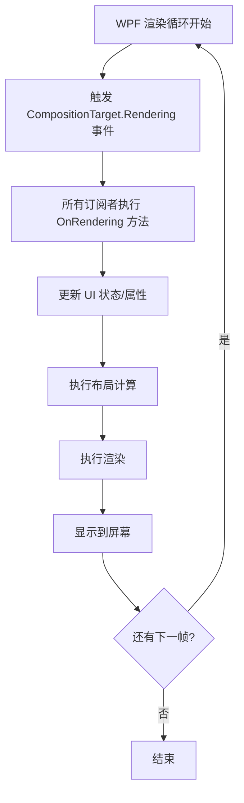
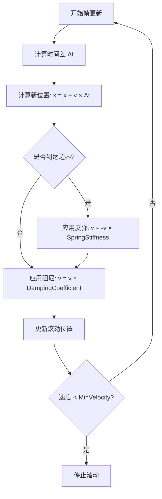

# WPF ScrollViewer 实现鼠标的平滑滚动

> [!abstract] 概述
> 本文档详细讲解如何使用**二阶缓动物理系统**实现一个带有惯性滚动的自定义 ScrollViewer。相比 WPF 默认的 ScrollViewer（基于物理像素，无惯性），这个实现提供了流畅的滚动体验，类似于现代移动应用和 Web 浏览器的滚动效果。

---

## 📊 WPF 原生 ScrollViewer vs 自定义惯性滚动 ScrollViewer

### 对比总览

| 特性 | WPF 原生 ScrollViewer | 自定义惯性滚动 ScrollViewer |
|------|----------------------|---------------------------|
| **滚动方式** | 基于物理像素，直接跳转 | 基于物理模拟，平滑过渡 |
| **惯性滚动** | ❌ 无惯性，滚动立即停止 | ✅ 有惯性，滚动逐渐减速 |
| **用户体验** | 传统桌面应用风格 | 现代移动应用风格 |
| **性能开销** | 低（原生实现） | 中等（需要物理计算） |
| **可定制性** | 有限 | 高（可调整物理参数） |
| **边界处理** | 硬停止 | 弹性反弹（可选） |

### WPF 原生 ScrollViewer 的优缺点

#### ✅ 优点

1. **性能优异**
   - 原生实现，性能开销极低
   - 无需额外的物理计算
   - 内存占用小

2. **简单直接**
   - 滚动行为可预测
   - 滚动距离精确（1:1 对应像素）
   - 适合需要精确控制的场景

3. **稳定性高**
   - 经过长期测试和优化
   - 兼容性好，无意外行为
   - 适合企业级应用

4. **资源占用低**
   - 不需要额外的动画循环
   - 不需要高精度时间测量
   - 适合资源受限的环境

#### ❌ 缺点

1. **无惯性滚动**
   ```csharp
   // 原生 ScrollViewer：滚轮滚动后立即停止
   // 用户需要多次滚动才能浏览长内容
   ```

2. **交互体验落后**
   - 不符合现代用户习惯（移动应用、Web 浏览器都有惯性滚动）
   - 滚动感觉"生硬"、"机械"
   - 无法通过快速拖拽产生惯性滚动

3. **可定制性有限**
   - 无法调整滚动速度曲线
   - 无法实现边界反弹效果
   - 无法自定义滚动动画

4. **长内容浏览困难**
   - 需要频繁操作滚轮
   - 无法通过快速拖拽快速浏览
   - 用户体验较差

### 自定义惯性滚动 ScrollViewer 的优缺点

#### ✅ 优点

1. **流畅的用户体验**
   ```csharp
   // 自定义实现：滚轮滚动后继续惯性滚动
   // 用户可以快速浏览长内容，体验更自然
   ```
   - 符合现代用户习惯
   - 滚动感觉"流畅"、"自然"
   - 类似移动应用和 Web 浏览器的体验

2. **惯性滚动**
   - 滚轮滚动后继续滚动，逐渐减速
   - 快速拖拽后产生惯性滚动
   - 减少用户操作次数

3. **高度可定制**
   - 可调整物理参数（阻尼系数、弹性系数等）
   - 可实现边界反弹效果
   - 可自定义滚动动画曲线

4. **物理模拟**
   - 基于真实的物理模型
   - 滚动行为符合物理直觉
   - 提供视觉反馈（边界反弹）

5. **长内容浏览友好**
   - 快速滚动浏览大量内容
   - 减少滚轮操作次数
   - 提高浏览效率

#### ❌ 缺点

1. **性能开销**
   - 需要每帧进行物理计算
   - 需要订阅 `CompositionTarget.Rendering` 事件
   - 在低性能设备上可能影响流畅度

2. **实现复杂度**
   - 需要理解物理模型
   - 需要处理边界情况
   - 需要调试和优化参数

3. **资源占用**
   - 需要高精度时间测量（`Stopwatch`）
   - 需要维护状态变量
   - 需要事件订阅/取消订阅管理

4. **可能的不稳定性**
   - 自定义实现可能有意外的边界情况
   - 需要充分测试
   - 可能与其他控件有兼容性问题

5. **精确度权衡**
   - 滚动距离不是精确的 1:1 像素对应
   - 可能不适合需要精确控制的场景（如 CAD 软件）

### 使用场景建议

#### 适合使用原生 ScrollViewer 的场景

> [!tip] 推荐场景
> - ✅ 企业级应用（需要稳定性和可预测性）
> - ✅ 需要精确控制滚动位置的场景（如 CAD、图像编辑）
> - ✅ 资源受限的环境（嵌入式系统、低性能设备）
> - ✅ 简单的列表展示（不需要复杂交互）
> - ✅ 需要与现有 WPF 应用保持一致性的场景

#### 适合使用自定义惯性滚动 ScrollViewer 的场景

> [!tip] 推荐场景
> - ✅ 现代桌面应用（追求流畅体验）
> - ✅ 内容浏览类应用（文档阅读器、新闻客户端）
> - ✅ 需要快速浏览大量内容的场景
> - ✅ 面向年轻用户群体的应用
> - ✅ 需要与移动应用保持体验一致性的场景

### 性能对比示例

#### 原生 ScrollViewer
```
用户操作：滚轮滚动 3 次
  ↓
滚动距离：每次 3 行 × 3 次 = 9 行
  ↓
结果：立即停止，用户需要继续滚动
```

#### 自定义惯性滚动 ScrollViewer
```
用户操作：滚轮快速滚动 3 次
  ↓
初始速度：高速度
  ↓
惯性滚动：继续滚动 20+ 行，逐渐减速
  ↓
结果：一次操作浏览更多内容
```

### 总结

> [!note] 选择建议
> - **追求稳定性和精确性** → 使用原生 ScrollViewer
> - **追求流畅体验和现代感** → 使用自定义惯性滚动 ScrollViewer
> - **资源受限** → 使用原生 ScrollViewer
> - **需要快速浏览长内容** → 使用自定义惯性滚动 ScrollViewer

---

## 📐 物理模型：二阶缓动系统

### 核心概念

我们使用**二阶缓动系统**（Second-Order System）来模拟真实的物理运动。这个系统基于以下物理原理：

#### 1. 位置、速度、加速度的关系

在物理学中，位置、速度和加速度之间存在以下关系：

$$
\begin{align}
v(t) &= \frac{dx(t)}{dt} \quad \text{(速度是位置的导数)} \\
a(t) &= \frac{dv(t)}{dt} = \frac{d^2x(t)}{dt^2} \quad \text{(加速度是速度的导数)}
\end{align}
$$

#### 2. 阻尼振荡系统

我们的滚动系统可以建模为一个**阻尼振荡器**（Damped Oscillator）：

$$
m \frac{d^2x}{dt^2} + c \frac{dx}{dt} + kx = F(t)
$$

其中：
- $m$ = 质量（在我们的实现中简化为 1）
- $c$ = 阻尼系数（Damping Coefficient）
- $k$ = 弹性系数（Spring Stiffness）
- $F(t)$ = 外力（用户输入）

> [!tip] 简化模型
> 在我们的实现中，我们简化了这个模型：
> - 不考虑质量（$m = 1$）
> - 不考虑弹性恢复力（$k = 0$，除非在边界处）
> - 主要关注**速度衰减**和**边界反弹**

### 离散时间实现

由于我们使用帧更新（Frame-based Update），需要将连续时间的微分方程转换为离散时间的递推关系：

#### 速度衰减公式

每帧更新时，速度按阻尼系数衰减：

$$
v_{n+1} = v_n \times \text{DampingCoefficient}
$$

其中 `DampingCoefficient = 0.96`，意味着每帧速度衰减到原来的 96%。

#### 位置更新公式

位置根据当前速度和时间步长更新：

$$
x_{n+1} = x_n + v_n \times \Delta t
$$

其中 $\Delta t$ 是实际的时间步长（秒）。

#### 边界反弹公式

当到达边界时，速度反向并衰减：

$$
v_{n+1} = -v_n \times \text{SpringStiffness}
$$

其中 `SpringStiffness = 0.25`，意味着反弹时速度变为原来的 25%。

---

## 🔧 实现细节

### 1. 物理参数配置

```csharp
// 物理参数
private const double DampingCoefficient = 0.96;  // 阻尼系数
private const double MinVelocity = 0.1;           // 最小速度阈值
private const double SpringStiffness = 0.25;     // 弹性系数
private const double VelocityMultiplier = 16.0;   // 速度倍数
```

> [!info] 参数说明
> - **DampingCoefficient (0.96)**: 控制速度衰减速度。值越大，滚动持续时间越长。范围：0-1
> - **MinVelocity (0.1)**: 最小速度阈值。当速度低于此值时停止滚动，避免无限小的微动
> - **SpringStiffness (0.25)**: 边界反弹强度。值越大，反弹越明显
> - **VelocityMultiplier (16.0)**: 速度倍数，用于调整整体滚动速度

### 2. 高精度时间测量

> [!important] 为什么使用 Stopwatch？
> WPF 的 `DispatcherTimer` 精度有限（通常 15-16ms），且使用固定时间间隔。我们使用 `Stopwatch.GetTimestamp()` 来获得高精度时间戳，计算**实际的时间差**，确保物理计算的准确性。

```csharp
// 使用高精度时间戳
long currentTime = Stopwatch.GetTimestamp();
double deltaTime = (currentTime - _lastAnimationTime) / (double)Stopwatch.Frequency;
```

**优势**：
- 自动适配不同的帧率（60Hz、120Hz、144Hz 等）
- 处理卡顿情况（时间步长会自动增大）
- 更准确的物理模拟

### 3. 事件拦截与处理

#### 鼠标滚轮事件

```csharp
private void OnPreviewMouseWheel(object sender, MouseWheelEventArgs e)
{
    // 计算初始速度（基于滚轮增量）
    double delta = e.Delta;
    double velocity = delta * 0.5 * VelocityMultiplier;
    
    // 根据滚轮方向设置速度
    _velocityY = e.Delta > 0 ? -Math.Abs(velocity) : Math.Abs(velocity);
    
    // 启动惯性滚动
    StartInertialScroll();
    
    // 阻止默认滚动行为
    e.Handled = true;
}
```

> [!note] 关键点
> - 使用 `PreviewMouseWheel` 事件在默认处理之前拦截
> - 将滚轮增量转换为初始速度
> - 设置 `e.Handled = true` 阻止默认滚动

#### 鼠标拖拽事件

拖拽时，我们需要：
1. 实时跟踪鼠标位置
2. 计算速度（基于位移和时间差）
3. 直接更新滚动位置

```csharp
private void OnMouseMove(object sender, MouseEventArgs e)
{
    if (!_isDragging) return;
    
    Point currentPosition = e.GetPosition(this);
    long currentTime = Stopwatch.GetTimestamp();
    
    // 计算时间差
    double deltaTime = (currentTime - _lastUpdateTime) / (double)Stopwatch.Frequency;
    if (deltaTime < 0.0001) deltaTime = 0.0001; // 防止除零
    
    // 计算位移
    double deltaX = currentPosition.X - _lastMousePosition.X;
    double deltaY = currentPosition.Y - _lastMousePosition.Y;
    
    // 计算速度（像素/秒）
    double rawVelocityX = (deltaX / deltaTime) * VelocityMultiplier;
    double rawVelocityY = (deltaY / deltaTime) * VelocityMultiplier;
    
    // 直接使用计算的速度（不进行平滑处理，让速度可以更快）
    _velocityX = rawVelocityX;
    _velocityY = rawVelocityY;
    
    // 直接移动滚动位置
    double newOffsetX = HorizontalOffset - deltaX;
    double newOffsetY = VerticalOffset - deltaY;
    
    ScrollToHorizontalOffset(Math.Max(0, Math.Min(ScrollableWidth, newOffsetX)));
    ScrollToVerticalOffset(Math.Max(0, Math.Min(ScrollableHeight, newOffsetY)));
    
    // 更新状态
    _lastMousePosition = currentPosition;
    _lastUpdateTime = currentTime;
}
```

> [!tip] 速度计算
> 速度 = 位移 / 时间差 × 速度倍数
> 
> 例如：如果鼠标在 0.016 秒内移动了 10 像素，则速度为：
> $v = \frac{10}{0.016} \times 16 = 10,000$ 像素/秒

### 4. 动画更新：CompositionTarget.Rendering

#### 什么是 CompositionTarget.Rendering？

> [!info] CompositionTarget.Rendering 详解
> `CompositionTarget.Rendering` 是 WPF 渲染管道的核心事件，它在**每一帧渲染之前**被触发。这个事件是**静态事件**（Static Event），意味着它是全局的，所有订阅者都会在每帧被调用。

##### 工作原理



##### 关键特性

1. **UI 线程执行**
   - ✅ 所有事件处理都在 **UI 线程**上执行
   - ✅ 可以直接修改 UI 元素，无需 `Dispatcher.Invoke`
   - ✅ 线程安全（因为都在同一线程）

2. **与渲染同步**
   - ✅ 在**每帧渲染之前**调用
   - ✅ 确保动画更新在渲染前完成
   - ✅ 避免视觉撕裂和不一致

3. **自动适配帧率**
   - ✅ 60Hz 显示器：每秒调用 60 次
   - ✅ 120Hz 显示器：每秒调用 120 次
   - ✅ 144Hz 显示器：每秒调用 144 次
   - ✅ 自动适配，无需手动配置

4. **静态事件机制**
   ```csharp
   // CompositionTarget 是静态类
   public static class CompositionTarget
   {
       // Rendering 是静态事件
       public static event EventHandler Rendering;
   }
   ```

> [!warning] 重要提示
> 由于是静态事件，所有订阅者都会在每帧被调用。如果订阅者很多或执行耗时操作，会影响整体性能。因此：
> - ✅ 只在需要时订阅（如我们的 `StartInertialScroll`）
> - ✅ 及时取消订阅（如我们的 `StopInertialScroll`）
> - ✅ 保持事件处理函数高效

#### 订阅机制详解

##### 订阅过程

```csharp
private void StartInertialScroll()
{
    if (!_isScrolling)
    {
        _isScrolling = true;
        _lastAnimationTime = Stopwatch.GetTimestamp();
        
        // 订阅事件：将 OnRendering 方法添加到事件处理列表
        CompositionTarget.Rendering += OnRendering;
    }
}
```

**发生了什么？**
1. `CompositionTarget.Rendering` 是静态事件，所有订阅者共享
2. `+= OnRendering` 将我们的方法添加到事件处理列表
3. 从下一帧开始，WPF 会在每帧渲染前调用 `OnRendering`

##### 取消订阅过程

```csharp
private void StopInertialScroll()
{
    if (_isScrolling)
    {
        _isScrolling = false;
        _velocityX = 0;
        _velocityY = 0;
        
        // 取消订阅：从事件处理列表中移除 OnRendering
        CompositionTarget.Rendering -= OnRendering;
    }
}
```

**发生了什么？**
1. `-= OnRendering` 将我们的方法从事件处理列表中移除
2. 从下一帧开始，`OnRendering` 不再被调用
3. 节省 CPU 资源（不再执行不必要的计算）

#### 事件调用时机

```
帧 N 开始
  ↓
触发 CompositionTarget.Rendering 事件
  ↓
执行所有订阅者的处理函数（包括我们的 OnRendering）
  ↓
  ├─ 计算物理状态（位置、速度）
  ├─ 更新 ScrollViewer 的滚动位置
  └─ 检查是否需要停止滚动
  ↓
执行布局计算（Layout）
  ↓
执行渲染（Render）
  ↓
显示到屏幕
  ↓
帧 N 结束，等待下一帧（帧 N+1）
```

#### 为什么比 DispatcherTimer 更好？

| 特性 | CompositionTarget.Rendering | DispatcherTimer |
|------|----------------------------|-----------------|
| **调用时机** | 每帧渲染前 | 固定时间间隔 |
| **帧率适配** | 自动适配（60/120/144Hz） | 固定间隔（通常 16ms） |
| **同步性** | 与渲染完全同步 | 可能不同步 |
| **平滑度** | 更平滑，无卡顿感 | 可能卡顿 |
| **性能** | 更高效（与渲染管道集成） | 额外线程开销 |
| **精度** | 高精度（基于实际帧时间） | 固定精度 |

##### 实际对比示例

**DispatcherTimer（固定间隔）**：
```
时间轴: 0ms    16ms    32ms    48ms    64ms
更新:   ✓      ✓       ✓       ✓       ✓
渲染:   ?      ?       ?       ?       ?
```
❌ 更新和渲染可能不同步，导致视觉不连贯

**CompositionTarget.Rendering（与渲染同步）**：
```
时间轴: 0ms    16.67ms 33.33ms 50ms    66.67ms
更新:   ✓      ✓       ✓       ✓       ✓
渲染:   ✓      ✓       ✓       ✓       ✓
```
✅ 更新和渲染完全同步，视觉连贯

#### 在我们的实现中的作用

```csharp
private void OnRendering(object? sender, EventArgs e)
{
    if (!_isScrolling) return; // 安全检查
    
    // 1. 计算实际时间差（基于高精度时间戳）
    long currentTime = Stopwatch.GetTimestamp();
    double deltaTime = (currentTime - _lastAnimationTime) / (double)Stopwatch.Frequency;
    _lastAnimationTime = currentTime;
    
    // 2. 执行物理计算（位置、速度、边界检测）
    // ... 物理更新逻辑 ...
    
    // 3. 更新 UI（滚动位置）
    ScrollToHorizontalOffset(newX);
    ScrollToVerticalOffset(newY);
    
    // 4. 检查停止条件
    if (Math.Abs(_velocityX) < MinVelocity && Math.Abs(_velocityY) < MinVelocity)
    {
        StopInertialScroll(); // 自动取消订阅
    }
}
```

> [!tip] 关键点
> 1. **每帧调用**：只要订阅了事件，每帧都会调用 `OnRendering`
> 2. **UI 线程执行**：可以直接修改 UI，无需线程切换
> 3. **自动停止**：当速度低于阈值时，自动取消订阅，停止更新
> 4. **高效**：只在需要时订阅，不需要时立即取消

#### 性能考虑

##### 订阅/取消订阅的最佳实践

```csharp
// ✅ 正确：只在需要时订阅
private void StartInertialScroll()
{
    if (!_isScrolling) // 防止重复订阅
    {
        _isScrolling = true;
        CompositionTarget.Rendering += OnRendering;
    }
}

// ✅ 正确：及时取消订阅
private void StopInertialScroll()
{
    if (_isScrolling) // 防止重复取消订阅
    {
        _isScrolling = false;
        CompositionTarget.Rendering -= OnRendering;
    }
}
```

##### 避免的问题

```csharp
// ❌ 错误：忘记取消订阅
private void StartInertialScroll()
{
    CompositionTarget.Rendering += OnRendering;
    // 没有对应的取消订阅，导致内存泄漏和性能问题
}

// ❌ 错误：重复订阅
private void StartInertialScroll()
{
    CompositionTarget.Rendering += OnRendering;
    CompositionTarget.Rendering += OnRendering; // 订阅了两次！
    // 导致 OnRendering 被调用两次，浪费资源
}
```

> [!success] 总结
> `CompositionTarget.Rendering` 是 WPF 渲染管道的核心事件，它在每帧渲染前触发，让我们可以在 UI 线程上执行动画更新。通过订阅这个事件，我们的物理计算和滚动逻辑会在每帧被调用，实现流畅的惯性滚动效果。

### 5. 核心物理更新循环

这是整个系统的核心，每帧都会执行：

```csharp
private void OnRendering(object? sender, EventArgs e)
{
    if (!_isScrolling) return;
    
    long currentTime = Stopwatch.GetTimestamp();
    
    // 1. 计算实际时间差
    double deltaTime = (currentTime - _lastAnimationTime) / (double)Stopwatch.Frequency;
    _lastAnimationTime = currentTime;
    
    // 限制异常大的时间步长（防止卡顿）
    if (deltaTime > 0.1) deltaTime = 0.1;
    if (deltaTime < 0.0001) return;
    
    // 2. 获取当前滚动位置
    double currentX = HorizontalOffset;
    double currentY = VerticalOffset;
    
    // 3. 计算新位置（根据速度和时间步长）
    double newX = currentX + _velocityX * deltaTime;
    double newY = currentY + _velocityY * deltaTime;
    
    // 4. 边界检测和反弹
    bool hitBoundaryX = false;
    bool hitBoundaryY = false;
    
    if (newX < 0)
    {
        newX = 0;
        hitBoundaryX = true;
    }
    else if (newX > ScrollableWidth)
    {
        newX = ScrollableWidth;
        hitBoundaryX = true;
    }
    
    if (newY < 0)
    {
        newY = 0;
        hitBoundaryY = true;
    }
    else if (newY > ScrollableHeight)
    {
        newY = ScrollableHeight;
        hitBoundaryY = true;
    }
    
    // 5. 应用边界反弹（弹性效果）
    if (hitBoundaryX)
    {
        _velocityX = -_velocityX * SpringStiffness;
    }
    
    if (hitBoundaryY)
    {
        _velocityY = -_velocityY * SpringStiffness;
    }
    
    // 6. 应用阻尼（速度衰减）
    _velocityX *= DampingCoefficient;
    _velocityY *= DampingCoefficient;
    
    // 7. 更新滚动位置
    ScrollToHorizontalOffset(newX);
    ScrollToVerticalOffset(newY);
    
    // 8. 检查是否应该停止滚动
    if (Math.Abs(_velocityX) < MinVelocity && Math.Abs(_velocityY) < MinVelocity)
    {
        StopInertialScroll();
    }
}
```

#### 更新流程详解



---

## 🎯 关键设计决策

### 1. 为什么移除速度平滑处理？

**原始实现**（会限制速度）：
```csharp
_velocityX = _velocityX * 0.8 + _lastDeltaX * 0.2; // 平滑处理
```

**优化后**（不限制速度）：
```csharp
_velocityX = rawVelocityX; // 直接使用计算的速度
```

> [!warning] 原因
> 平滑处理会限制速度的快速变化，导致快速拖拽时速度无法达到预期值。移除平滑处理后，速度可以更快，响应更灵敏。

### 2. 时间步长限制策略

```csharp
// 只限制异常大的时间步长（防止卡顿），但不限制正常的速度
if (deltaTime > 0.1) deltaTime = 0.1; // 允许更大的时间步长
if (deltaTime < 0.0001) return; // 跳过过小的步长
```

> [!tip] 设计思路
> - **上限 (0.1s)**：防止卡顿导致的异常大值破坏物理模拟
> - **下限 (0.0001s)**：跳过过小的步长，避免无效计算

### 3. 边界处理策略

当滚动到达边界时，我们有两个选择：

1. **硬停止**：速度直接设为 0
2. **弹性反弹**：速度反向并衰减（当前实现）

我们选择弹性反弹，因为：
- 更自然的交互体验
- 符合物理直觉
- 提供视觉反馈

---

## 📊 性能优化

### 1. 使用高精度时间戳

- ✅ 自动适配不同帧率
- ✅ 处理卡顿情况
- ✅ 更准确的物理计算

### 2. CompositionTarget.Rendering vs DispatcherTimer

| 特性 | CompositionTarget.Rendering | DispatcherTimer |
|------|----------------------------|-----------------|
| 同步性 | 与渲染同步 | 固定间隔 |
| 帧率适配 | 自动适配 | 固定 60 FPS |
| 平滑度 | 更平滑 | 可能卡顿 |
| 性能 | 更好 | 一般 |

### 3. 避免不必要的计算

- 只在滚动时更新（`if (!_isScrolling) return;`）
- 跳过过小的时间步长
- 及时停止滚动（速度低于阈值时）

---

## 🔍 调试技巧

### 1. 调整物理参数

如果滚动太快或太慢，可以调整：

```csharp
private const double DampingCoefficient = 0.96;  // 增大 = 滚动更持久
private const double MinVelocity = 0.1;         // 降低 = 滚动持续更久
private const double VelocityMultiplier = 16.0;  // 调整整体速度
```

### 2. 监控性能

可以添加性能计数器来监控：

```csharp
private int _frameCount = 0;
private long _lastFpsTime = 0;

private void OnRendering(object? sender, EventArgs e)
{
    _frameCount++;
    long currentTime = Stopwatch.GetTimestamp();
    if ((currentTime - _lastFpsTime) / (double)Stopwatch.Frequency > 1.0)
    {
        double fps = _frameCount;
        Debug.WriteLine($"FPS: {fps}");
        _frameCount = 0;
        _lastFpsTime = currentTime;
    }
    // ... 其他代码
}
```

---

## 📝 完整代码结构

```
FluentScrollViewer
├── 物理参数（常量）
│   ├── DampingCoefficient
│   ├── MinVelocity
│   ├── SpringStiffness
│   └── VelocityMultiplier
├── 状态变量
│   ├── _velocityX, _velocityY
│   ├── _isScrolling
│   ├── _isDragging
│   └── 时间戳变量
├── 事件处理
│   ├── OnPreviewMouseWheel（滚轮）
│   ├── OnMouseLeftButtonDown（按下）
│   ├── OnMouseMove（移动）
│   ├── OnMouseLeftButtonUp（释放）
│   └── OnMouseLeave（离开）
└── 核心逻辑
    ├── StartInertialScroll（启动）
    ├── StopInertialScroll（停止）
    └── OnRendering（物理更新）
```


```cs
using System;  
using System.Diagnostics;  
using System.Windows;  
using System.Windows.Controls;  
using System.Windows.Input;  
using System.Windows.Media;  
using System.Windows.Threading;  
  
namespace FluentScrollviewerSolution;  
  
/// <summary>  
/// 带有惯性滚动的自定义 ScrollViewer/// 使用二阶缓动物理系统实现平滑的惯性滚动效果  
/// </summary>  
public class FluentScrollViewer : ScrollViewer  
{  
    // 物理参数  
    private const double DampingCoefficient = 0.96; // 阻尼系数，控制速度衰减速度（0-1，越小衰减越快，增大让滚动更持久）  
    private const double MinVelocity = 0.1; // 最小速度阈值，低于此值停止滚动（降低让滚动持续更久）  
    private const double SpringStiffness = 0.25; // 弹性系数，控制边界反弹强度  
    private const double VelocityMultiplier = 16.0; // 速度倍数，让惯性滚动更快  
    // 滚动状态  
    private double _velocityX;  
    private double _velocityY;  
    private bool _isScrolling;  
    private long _lastAnimationTime; // 使用高精度时间戳  
    // 鼠标/触摸状态  
    private Point _lastMousePosition;  
    private bool _isDragging;  
    private long _lastUpdateTime; // 使用高精度时间戳  
    private double _lastDeltaX;  
    private double _lastDeltaY;  
    static FluentScrollViewer()  
    {        DefaultStyleKeyProperty.OverrideMetadata(typeof(FluentScrollViewer),   
new FrameworkPropertyMetadata(typeof(FluentScrollViewer)));  
    }    public FluentScrollViewer()  
    {        // 禁用默认的滚动行为  
        this.PreviewMouseWheel += OnPreviewMouseWheel;  
        this.MouseLeftButtonDown += OnMouseLeftButtonDown;  
        this.MouseMove += OnMouseMove;  
        this.MouseLeftButtonUp += OnMouseLeftButtonUp;  
        this.MouseLeave += OnMouseLeave;  
        // 初始化高精度时间戳  
        _lastAnimationTime = Stopwatch.GetTimestamp();  
        _lastUpdateTime = Stopwatch.GetTimestamp();  
    }    /// <summary>  
    /// 拦截鼠标滚轮事件，转换为惯性滚动  
    /// </summary>  
    private void OnPreviewMouseWheel(object sender, MouseWheelEventArgs e)  
    {        // 计算初始速度（基于滚轮增量）  
        double delta = e.Delta;  
        double velocity = delta * 0.5 * VelocityMultiplier; // 调整速度系数，应用速度倍数  
        if (e.Delta > 0)  
        {            // 向上滚动  
            _velocityY = -Math.Abs(velocity);  
        }        else  
        {  
            // 向下滚动  
            _velocityY = Math.Abs(velocity);  
        }        // 启动惯性滚动  
        StartInertialScroll();  
        // 标记事件已处理，阻止默认滚动  
        e.Handled = true;  
    }    /// <summary>  
    /// 鼠标按下，开始拖拽  
    /// </summary>  
    private void OnMouseLeftButtonDown(object sender, MouseButtonEventArgs e)  
    {        if (e.ChangedButton != MouseButton.Left) return;  
        _isDragging = true;  
        _lastMousePosition = e.GetPosition(this);  
        _lastUpdateTime = Stopwatch.GetTimestamp();  
        _lastDeltaX = 0;  
        _lastDeltaY = 0;  
        // 停止惯性滚动  
        StopInertialScroll();  
        this.CaptureMouse();  
        e.Handled = true;  
    }    /// <summary>  
    /// 鼠标移动，计算拖拽速度  
    /// </summary>  
    private void OnMouseMove(object sender, MouseEventArgs e)  
    {        if (!_isDragging) return;  
        Point currentPosition = e.GetPosition(this);  
        long currentTime = Stopwatch.GetTimestamp();  
        // 计算时间差（秒），使用高精度时间戳  
        double deltaTime = (currentTime - _lastUpdateTime) / (double)Stopwatch.Frequency;  
        if (deltaTime < 0.0001) deltaTime = 0.0001; // 防止除零，使用更小的最小值  
        // 计算位移  
        double deltaX = currentPosition.X - _lastMousePosition.X;  
        double deltaY = currentPosition.Y - _lastMousePosition.Y;  
        // 计算速度（像素/秒），应用速度倍数让惯性滚动更快，不限制速度  
        double rawVelocityX = (deltaX / deltaTime) * VelocityMultiplier;  
        double rawVelocityY = (deltaY / deltaTime) * VelocityMultiplier;  
        // 直接使用计算的速度，不进行平滑处理，让速度可以更快  
        _velocityX = rawVelocityX;  
        _velocityY = rawVelocityY;  
        // 直接移动滚动位置  
        double newOffsetX = HorizontalOffset - deltaX;  
        double newOffsetY = VerticalOffset - deltaY;  
        ScrollToHorizontalOffset(Math.Max(0, Math.Min(ScrollableWidth, newOffsetX)));  
        ScrollToVerticalOffset(Math.Max(0, Math.Min(ScrollableHeight, newOffsetY)));  
        // 更新状态  
        _lastMousePosition = currentPosition;  
        _lastUpdateTime = currentTime;  
        _lastDeltaX = _velocityX;  
        _lastDeltaY = _velocityY;  
    }    /// <summary>  
    /// 鼠标释放，开始惯性滚动  
    /// </summary>  
    private void OnMouseLeftButtonUp(object sender, MouseButtonEventArgs e)  
    {        if (!_isDragging) return;  
        _isDragging = false;  
        this.ReleaseMouseCapture();  
        // 如果速度足够大，启动惯性滚动  
        if (Math.Abs(_velocityX) > MinVelocity || Math.Abs(_velocityY) > MinVelocity)  
        {            StartInertialScroll();  
        }        e.Handled = true;  
    }    /// <summary>  
    /// 鼠标离开，停止拖拽  
    /// </summary>  
    private void OnMouseLeave(object sender, MouseEventArgs e)  
    {        if (_isDragging)  
        {            _isDragging = false;  
            this.ReleaseMouseCapture();  
            // 如果速度足够大，启动惯性滚动  
            if (Math.Abs(_velocityX) > MinVelocity || Math.Abs(_velocityY) > MinVelocity)  
            {                StartInertialScroll();  
            }        }    }    /// <summary>  
    /// 启动惯性滚动  
    /// </summary>  
    private void StartInertialScroll()  
    {        if (!_isScrolling)  
        {            _isScrolling = true;  
            _lastAnimationTime = Stopwatch.GetTimestamp();  
            CompositionTarget.Rendering += OnRendering;  
        }    }    /// <summary>  
    /// 停止惯性滚动  
    /// </summary>  
    private void StopInertialScroll()  
    {        if (_isScrolling)  
        {            _isScrolling = false;  
            _velocityX = 0;  
            _velocityY = 0;  
            CompositionTarget.Rendering -= OnRendering;  
        }    }    /// <summary>  
    /// 渲染帧更新，实现二阶缓动物理系统（使用CompositionTarget.Rendering获得更平滑的动画）  
    /// </summary>  
    private void OnRendering(object? sender, EventArgs e)  
    {        if (!_isScrolling) return;  
        long currentTime = Stopwatch.GetTimestamp();  
        // 计算实际时间差（秒），使用高精度时间戳  
        double deltaTime = (currentTime - _lastAnimationTime) / (double)Stopwatch.Frequency;  
        _lastAnimationTime = currentTime;  
        // 只限制异常大的时间步长（防止卡顿），但不限制正常的速度  
        if (deltaTime > 0.1) deltaTime = 0.1; // 允许更大的时间步长，不强制限制为16ms  
        if (deltaTime < 0.0001) return; // 跳过过小的步长  
        // 获取当前滚动位置  
        double currentX = HorizontalOffset;  
        double currentY = VerticalOffset;  
        // 计算新位置  
        double newX = currentX + _velocityX * deltaTime;  
        double newY = currentY + _velocityY * deltaTime;  
        // 边界检测和反弹  
        bool hitBoundaryX = false;  
        bool hitBoundaryY = false;  
        if (newX < 0)  
        {            newX = 0;  
            hitBoundaryX = true;  
        }        else if (newX > ScrollableWidth)  
        {            newX = ScrollableWidth;  
            hitBoundaryX = true;  
        }        if (newY < 0)  
        {            newY = 0;  
            hitBoundaryY = true;  
        }        else if (newY > ScrollableHeight)  
        {            newY = ScrollableHeight;  
            hitBoundaryY = true;  
        }        // 应用边界反弹（弹性效果）  
        if (hitBoundaryX)  
        {            _velocityX = -_velocityX * SpringStiffness; // 反弹并衰减  
        }  
        if (hitBoundaryY)  
        {            _velocityY = -_velocityY * SpringStiffness; // 反弹并衰减  
        }  
        // 应用阻尼（速度衰减）  
        _velocityX *= DampingCoefficient;  
        _velocityY *= DampingCoefficient;  
        // 更新滚动位置  
        ScrollToHorizontalOffset(newX);  
        ScrollToVerticalOffset(newY);  
        // 检查是否应该停止滚动  
        if (Math.Abs(_velocityX) < MinVelocity && Math.Abs(_velocityY) < MinVelocity)  
        {            StopInertialScroll();  
        }    }    protected override void OnRenderSizeChanged(SizeChangedInfo sizeInfo)  
    {        base.OnRenderSizeChanged(sizeInfo);  
        // 如果尺寸改变时正在滚动，可能需要调整位置  
        if (_isScrolling)  
        {            double newX = Math.Max(0, Math.Min(ScrollableWidth, HorizontalOffset));  
            double newY = Math.Max(0, Math.Min(ScrollableHeight, VerticalOffset));  
            ScrollToHorizontalOffset(newX);  
            ScrollToVerticalOffset(newY);  
        }    }}
```

---

## 🎓 总结

这个实现展示了如何：

1. ✅ **使用物理模型**：二阶缓动系统模拟真实运动
2. ✅ **高精度时间测量**：使用 `Stopwatch` 获得准确的时间差
3. ✅ **与渲染同步**：使用 `CompositionTarget.Rendering` 获得平滑动画
4. ✅ **事件拦截**：拦截默认滚动行为，实现自定义滚动
5. ✅ **性能优化**：避免不必要的计算，及时停止滚动

> [!success] 最终效果
> 实现了流畅的惯性滚动，类似于现代移动应用和 Web 浏览器的滚动体验，相比 WPF 默认的 ScrollViewer 有显著的改进。

---

## 🔗 相关资源

- [WPF CompositionTarget 文档](https://docs.microsoft.com/en-us/dotnet/api/system.windows.media.compositiontarget)
- [Stopwatch 高精度计时](https://docs.microsoft.com/en-us/dotnet/api/system.diagnostics.stopwatch)
- [二阶系统理论](https://en.wikipedia.org/wiki/Second-order_system)

---


