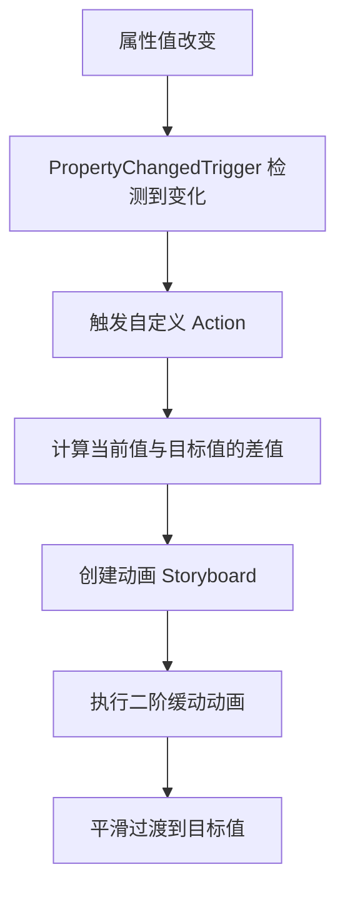
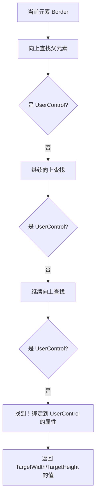
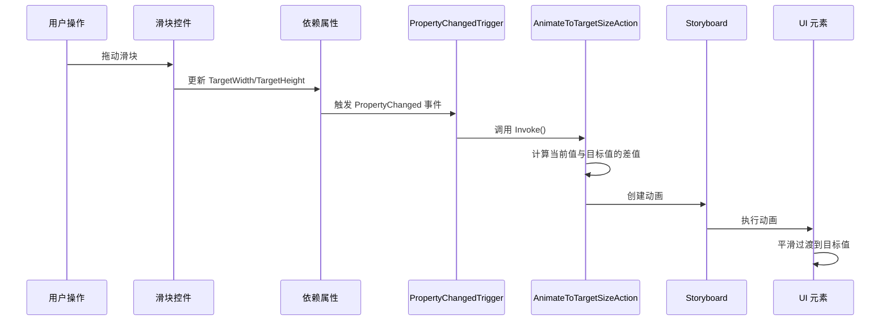

# 基于 PropertyChangedTrigger (属性变更触发器) 驱动的显式动画

> [!abstract] 概述
> 本文档详细讲解如何使用 **PropertyChangedTrigger**（属性变更触发器）和自定义 **Action** 实现响应式动画。当目标属性（如宽度、高度）改变时，自动计算与当前值的差值，并执行平滑的二阶缓动动画。

---

## 📋 核心概念

### 什么是 PropertyChangedTrigger？

`PropertyChangedTrigger` 是 Microsoft.Xaml.Behaviors.Wpf 库提供的一个触发器，它**监听数据绑定属性的变化**，当属性值改变时自动触发关联的 Action。

### 工作流程



### 与传统动画的区别

| 特性 | 传统动画 | PropertyChangedTrigger 驱动动画 |
|------|---------|-------------------------------|
| **触发方式** | 手动触发（事件、代码） | 自动触发（属性变化） |
| **响应性** | 需要手动管理 | 完全响应式 |
| **维护性** | 需要同步状态 | 声明式，易于维护 |
| **适用场景** | 一次性动画 | 数据驱动的动画 |

---

## 🏗️ 架构设计

### 组件结构

```
PropertyChangedTrigger 驱动动画系统
├── PropertyChangedTrigger（触发器）
│   └── 监听属性变化
├── 自定义 Action（动作）
│   ├── AnimateToTargetSizeAction
│   ├── 计算差值逻辑
│   └── 创建动画
└── 目标元素（UI 控件）
    └── 执行动画
```

### 关键组件说明

1. **PropertyChangedTrigger**
   - 监听数据绑定属性的变化
   - 当属性值改变时触发 Action

2. **自定义 Action（TriggerAction）**
   - 继承自 `TriggerAction<FrameworkElement>`
   - 实现动画逻辑
   - 计算当前值与目标值的差值

3. **动画目标元素**
   - 要动画化的 UI 元素
   - 通过依赖属性绑定目标值

---

## 💻 实现详解

### 1. 创建自定义 Action

#### 类定义

```csharp
using System;
using System.Windows;
using System.Windows.Media.Animation;
using Microsoft.Xaml.Behaviors;

namespace FluentScrollviewerSolution;

/// <summary>
/// 自定义 Action：当目标宽度/高度改变时，自动计算与当前值的差值，并执行二阶缓动动画
/// </summary>
public class AnimateToTargetSizeAction : TriggerAction<FrameworkElement>
{
    // 实现细节见下文
}
```

#### 依赖属性定义

```csharp
// 目标对象（要动画化的元素）
public FrameworkElement TargetObject
{
    get => (FrameworkElement)GetValue(TargetObjectProperty);
    set => SetValue(TargetObjectProperty, value);
}

public static readonly DependencyProperty TargetObjectProperty =
    DependencyProperty.Register(nameof(TargetObject), typeof(FrameworkElement), 
        typeof(AnimateToTargetSizeAction), new PropertyMetadata(null));

// 目标宽度
public double TargetWidth
{
    get => (double)GetValue(TargetWidthProperty);
    set => SetValue(TargetWidthProperty, value);
}

public static readonly DependencyProperty TargetWidthProperty =
    DependencyProperty.Register(nameof(TargetWidth), typeof(double), 
        typeof(AnimateToTargetSizeAction), new PropertyMetadata(double.NaN));

// 目标高度
public double TargetHeight
{
    get => (double)GetValue(TargetHeightProperty);
    set => SetValue(TargetHeightProperty, value);
}

public static readonly DependencyProperty TargetHeightProperty =
    DependencyProperty.Register(nameof(TargetHeight), typeof(double), 
        typeof(AnimateToTargetSizeAction), new PropertyMetadata(double.NaN));

    // 动画持续时间
    public Duration Duration { get; set; } = new Duration(TimeSpan.FromSeconds(0.2));
    
    // 缓动函数（默认使用二阶缓动 CubicEase）
    public IEasingFunction EasingFunction
    {
        get => (IEasingFunction)GetValue(EasingFunctionProperty);
        set => SetValue(EasingFunctionProperty, value);
    }
    
    public static readonly DependencyProperty EasingFunctionProperty =
        DependencyProperty.Register(
            nameof(EasingFunction), 
            typeof(IEasingFunction), 
            typeof(AnimateToTargetSizeAction), 
            new PropertyMetadata(new CubicEase { EasingMode = EasingMode.EaseInOut }));
```

> [!tip] 为什么使用依赖属性？
> - 支持数据绑定
> - 支持样式和模板
> - 支持动画
> - 性能优化（值缓存）
> - **EasingFunction**：提供默认值（CubicEase），可在 XAML 中自定义

#### 核心动画逻辑

```csharp
protected override void Invoke(object parameter)
{
    var target = TargetObject ?? AssociatedObject;
    if (target == null) return;
    
    // 1. 获取当前宽度和高度
    double currentWidth = target.Width;
    double currentHeight = target.Height;
    
    // 2. 如果当前值为 NaN 或 0，使用 ActualWidth/ActualHeight
    if (double.IsNaN(currentWidth) || currentWidth == 0)
        currentWidth = target.ActualWidth;
    if (double.IsNaN(currentHeight) || currentHeight == 0)
        currentHeight = target.ActualHeight;
    
    // 3. 创建动画序列
    var storyboard = new Storyboard();
    
    // 4. 动画化宽度（如果目标宽度有效且与当前值不同）
    if (!double.IsNaN(TargetWidth) && Math.Abs(TargetWidth - currentWidth) > 0.01)
    {
        var widthAnimation = CreateSecondOrderAnimation(currentWidth, TargetWidth);
        Storyboard.SetTarget(widthAnimation, target);
        Storyboard.SetTargetProperty(widthAnimation, 
            new PropertyPath(FrameworkElement.WidthProperty));
        storyboard.Children.Add(widthAnimation);
    }
    
    // 5. 动画化高度（如果目标高度有效且与当前值不同）
    if (!double.IsNaN(TargetHeight) && Math.Abs(TargetHeight - currentHeight) > 0.01)
    {
        var heightAnimation = CreateSecondOrderAnimation(currentHeight, TargetHeight);
        Storyboard.SetTarget(heightAnimation, target);
        Storyboard.SetTargetProperty(heightAnimation, 
            new PropertyPath(FrameworkElement.HeightProperty));
        storyboard.Children.Add(heightAnimation);
    }
    
    // 6. 如果至少有一个动画，则开始播放
    if (storyboard.Children.Count > 0)
    {
        storyboard.Begin(target);
    }
}
```

> [!important] 关键点
> 1. **差值计算**：自动计算 `目标值 - 当前值`
> 2. **阈值检查**：只有当差值大于 0.01 时才创建动画，避免不必要的动画
> 3. **NaN 处理**：如果当前值为 NaN，使用 `ActualWidth/ActualHeight` 作为当前值
> 4. **条件动画**：只有当目标值有效且与当前值不同时才创建动画

#### 缓动函数依赖属性

为了提高泛用性，我们添加了一个 `EasingFunction` 依赖属性，允许自定义缓动函数，默认使用二阶缓动（CubicEase）：

```csharp
// 缓动函数（默认使用二阶缓动 CubicEase）
public IEasingFunction EasingFunction
{
    get => (IEasingFunction)GetValue(EasingFunctionProperty);
    set => SetValue(EasingFunctionProperty, value);
}

public static readonly DependencyProperty EasingFunctionProperty =
    DependencyProperty.Register(
        nameof(EasingFunction), 
        typeof(IEasingFunction), 
        typeof(AnimateToTargetSizeAction), 
        new PropertyMetadata(new CubicEase { EasingMode = EasingMode.EaseInOut }));
```

> [!tip] 为什么使用依赖属性？
> - 支持在 XAML 中设置
> - 支持数据绑定
> - 支持样式和模板
> - 提供默认值（CubicEase）

#### 动画创建方法

```csharp
/// <summary>
/// 创建动画（使用指定的缓动函数，默认为二阶缓动 CubicEase）
/// </summary>
private DoubleAnimation CreateSecondOrderAnimation(double from, double to)
{
    var animation = new DoubleAnimation
    {
        From = from,        // 起始值（当前值）
        To = to,            // 目标值
        Duration = Duration, // 持续时间（默认 0.2 秒）
        // 使用指定的缓动函数（默认为 CubicEase，二阶缓动）
        EasingFunction = EasingFunction
    };
    
    return animation;
}
```

> [!note] 缓动函数说明
> - **默认值：CubicEase**：三次方缓动，提供平滑的加速和减速（二阶缓动）
> - **EaseInOut**：开始和结束时都平滑，中间加速
> - **可自定义**：可以在 XAML 中设置其他缓动函数

---

### 2. 在 XAML 中使用 PropertyChangedTrigger

#### 基本用法

```xml
<Border x:Name="AnimatedBorder">
    <i:Interaction.Triggers>
        <!-- 监听 TargetWidth 属性变化 -->
        <i:PropertyChangedTrigger 
            Binding="{Binding TargetWidth, RelativeSource={RelativeSource AncestorType=UserControl}}">
            <local:AnimateToTargetSizeAction 
                TargetObject="{Binding ElementName=AnimatedBorder}"
                TargetWidth="{Binding TargetWidth, RelativeSource={RelativeSource AncestorType=UserControl}}"
                TargetHeight="{Binding TargetHeight, RelativeSource={RelativeSource AncestorType=UserControl}}"
                Duration="0:0:0.2"/>
        </i:PropertyChangedTrigger>
        
        <!-- 监听 TargetHeight 属性变化 -->
        <i:PropertyChangedTrigger 
            Binding="{Binding TargetHeight, RelativeSource={RelativeSource AncestorType=UserControl}}">
            <local:AnimateToTargetSizeAction 
                TargetObject="{Binding ElementName=AnimatedBorder}"
                TargetWidth="{Binding TargetWidth, RelativeSource={RelativeSource AncestorType=UserControl}}"
                TargetHeight="{Binding TargetHeight, RelativeSource={RelativeSource AncestorType=UserControl}}"
                Duration="0:0:0.2"/>
        </i:PropertyChangedTrigger>
    </i:Interaction.Triggers>
</Border>
```

> [!tip] 为什么需要两个 PropertyChangedTrigger？
> - 分别监听宽度和高度的变化
> - 当任一属性改变时，都会触发动画
> - 确保宽度和高度都能独立动画化

#### 完整示例：AnimatedSizeControl

```xml
<UserControl x:Class="FluentScrollviewerSolution.AnimatedSizeControl"
             xmlns="http://schemas.microsoft.com/winfx/2006/xaml/presentation"
             xmlns:x="http://schemas.microsoft.com/winfx/2006/xaml"
             xmlns:i="http://schemas.microsoft.com/xaml/behaviors"
             xmlns:local="clr-namespace:FluentScrollviewerSolution">
    <Grid>
        <!-- 控制面板 -->
        <Border Grid.Row="0">
            <StackPanel>
                <Slider 
                    Value="{Binding TargetWidth, RelativeSource={RelativeSource AncestorType=UserControl}, Mode=TwoWay}"
                    Minimum="100" Maximum="800"/>
                <Slider 
                    Value="{Binding TargetHeight, RelativeSource={RelativeSource AncestorType=UserControl}, Mode=TwoWay}"
                    Minimum="100" Maximum="600"/>
            </StackPanel>
        </Border>
        
        <!-- 动画目标元素 -->
        <Border x:Name="AnimatedBorder" Grid.Row="1">
            <i:Interaction.Triggers>
                <i:PropertyChangedTrigger 
                    Binding="{Binding TargetWidth, RelativeSource={RelativeSource AncestorType=UserControl}}">
                    <local:AnimateToTargetSizeAction 
                        TargetObject="{Binding ElementName=AnimatedBorder}"
                        TargetWidth="{Binding TargetWidth, RelativeSource={RelativeSource AncestorType=UserControl}}"
                        TargetHeight="{Binding TargetHeight, RelativeSource={RelativeSource AncestorType=UserControl}}"
                        Duration="0:0:0.2"/>
                </i:PropertyChangedTrigger>
                
                <i:PropertyChangedTrigger 
                    Binding="{Binding TargetHeight, RelativeSource={RelativeSource AncestorType=UserControl}}">
                    <local:AnimateToTargetSizeAction 
                        TargetObject="{Binding ElementName=AnimatedBorder}"
                        TargetWidth="{Binding TargetWidth, RelativeSource={RelativeSource AncestorType=UserControl}}"
                        TargetHeight="{Binding TargetHeight, RelativeSource={RelativeSource AncestorType=UserControl}}"
                        Duration="0:0:0.2"/>
                </i:PropertyChangedTrigger>
            </i:Interaction.Triggers>
        </Border>
    </Grid>
</UserControl>
```

---

### 3. 代码后台：定义依赖属性

```csharp
public partial class AnimatedSizeControl : UserControl
{
    // 目标宽度依赖属性
    public static readonly DependencyProperty TargetWidthProperty =
        DependencyProperty.Register(
            nameof(TargetWidth),
            typeof(double),
            typeof(AnimatedSizeControl),
            new PropertyMetadata(300.0, OnTargetSizeChanged));
    
    // 目标高度依赖属性
    public static readonly DependencyProperty TargetHeightProperty =
        DependencyProperty.Register(
            nameof(TargetHeight),
            typeof(double),
            typeof(AnimatedSizeControl),
            new PropertyMetadata(200.0, OnTargetSizeChanged));
    
    public double TargetWidth
    {
        get => (double)GetValue(TargetWidthProperty);
        set => SetValue(TargetWidthProperty, value);
    }
    
    public double TargetHeight
    {
        get => (double)GetValue(TargetHeightProperty);
        set => SetValue(TargetHeightProperty, value);
    }
    
    public AnimatedSizeControl()
    {
        InitializeComponent();
        
        // 初始化动画目标元素的尺寸
        if (AnimatedBorder != null)
        {
            AnimatedBorder.Width = TargetWidth;
            AnimatedBorder.Height = TargetHeight;
        }
    }
    
    private static void OnTargetSizeChanged(DependencyObject d, DependencyPropertyChangedEventArgs e)
    {
        // PropertyChangedTrigger 会自动处理动画
        // 这里可以添加额外的逻辑（如果需要）
    }
}
```

---

## 🔗 RelativeSource 绑定详解

### 什么是 RelativeSource？

`RelativeSource` 是 WPF 数据绑定中的一个特殊标记扩展，它允许你**相对于当前元素在 UI 树中的位置**来查找绑定源，而不是使用绝对路径。

### RelativeSource 的语法

```xml
{Binding Path=PropertyName, RelativeSource={RelativeSource AncestorType=TargetType}}
```

其中：
- `Path`：要绑定的属性名
- `RelativeSource`：相对源标记
- `AncestorType`：要查找的祖先元素类型

### 工作原理：向上遍历 UI 树



#### 实际 UI 树结构

```
Window
└── TabControl
    └── TabItem
        └── AnimatedSizeControl (UserControl) ← 我们要找的目标
            └── Grid
                └── Border (AnimatedBorder) ← 当前元素
                    └── Interaction.Triggers
                        └── PropertyChangedTrigger ← 绑定在这里
```

**绑定过程**：
1. 从 `PropertyChangedTrigger` 开始
2. 向上查找：`PropertyChangedTrigger` → `Border` → `Grid` → `AnimatedSizeControl` ✅
3. 找到 `AnimatedSizeControl`（UserControl 类型）
4. 绑定到 `AnimatedSizeControl.TargetWidth` 属性

### 代码示例解析

```xml
<i:PropertyChangedTrigger 
    Binding="{Binding TargetWidth, RelativeSource={RelativeSource AncestorType=UserControl}}">
    <local:AnimateToTargetSizeAction 
        TargetObject="{Binding ElementName=AnimatedBorder}"
        TargetWidth="{Binding TargetWidth, RelativeSource={RelativeSource AncestorType=UserControl}}"
        TargetHeight="{Binding TargetHeight, RelativeSource={RelativeSource AncestorType=UserControl}}"
        Duration="0:0:0.4"/>
</i:PropertyChangedTrigger>
```

#### 逐行解释

**第 1 行：PropertyChangedTrigger 的 Binding**
```xml
Binding="{Binding TargetWidth, RelativeSource={RelativeSource AncestorType=UserControl}}"
```
- **Binding**：这是 PropertyChangedTrigger 要监听的属性
- **Path=TargetWidth**：要监听的属性名（可以省略 Path=）
- **RelativeSource={RelativeSource AncestorType=UserControl}**：
  - 向上查找最近的 `UserControl` 类型的元素
  - 找到后，绑定到该元素的 `TargetWidth` 属性

**第 3 行：TargetWidth 绑定**
```xml
TargetWidth="{Binding TargetWidth, RelativeSource={RelativeSource AncestorType=UserControl}}"
```
- 将 Action 的 `TargetWidth` 属性绑定到 UserControl 的 `TargetWidth` 属性
- 这样当 UserControl 的 `TargetWidth` 改变时，Action 也能获取到新值

### RelativeSource 的其他用法

#### 1. AncestorLevel（指定层级）

```xml
<!-- 向上查找第 2 个 UserControl（跳过第一个） -->
{Binding TargetWidth, RelativeSource={RelativeSource AncestorType=UserControl, AncestorLevel=2}}
```

#### 2. Self（绑定到自己）

```xml
<!-- 绑定到当前元素自己的属性 -->
{Binding Width, RelativeSource={RelativeSource Self}}
```

#### 3. TemplatedParent（模板父元素）

```xml
<!-- 在 ControlTemplate 中绑定到应用模板的控件 -->
{Binding DataContext, RelativeSource={RelativeSource TemplatedParent}}
```

#### 4. PreviousData（列表中的前一项）

```xml
<!-- 在 ItemsControl 中绑定到前一项数据 -->
{Binding PreviousData.Name}
```

### 与其他绑定方式的对比

| 绑定方式 | 语法 | 适用场景 |
|---------|------|---------|
| **RelativeSource AncestorType** | `{Binding Path, RelativeSource={RelativeSource AncestorType=Type}}` | 向上查找特定类型的祖先元素 |
| **ElementName** | `{Binding Path, ElementName=Name}` | 绑定到命名元素（同一 XAML 中） |
| **Source** | `{Binding Path, Source=Object}` | 绑定到代码中的对象 |
| **DataContext** | `{Binding Path}` | 绑定到 DataContext（默认） |

### 为什么使用 RelativeSource？

#### ✅ 优势

1. **灵活性**：不依赖具体的元素名称
2. **可复用性**：可以在不同的上下文中使用
3. **解耦**：不需要知道完整的 UI 树结构
4. **类型安全**：通过类型查找，而不是名称

#### ❌ 不使用 RelativeSource 的替代方案

**方案 1：使用 ElementName（需要命名）**
```xml
<!-- 需要给 UserControl 一个 x:Name -->
<UserControl x:Name="MyControl">
    <Border>
        <i:PropertyChangedTrigger 
            Binding="{Binding TargetWidth, ElementName=MyControl}">
            <!-- ... -->
        </i:PropertyChangedTrigger>
    </Border>
</UserControl>
```

**方案 2：使用 DataContext（需要设置）**
```xml
<!-- 需要设置 DataContext -->
<UserControl DataContext="{Binding RelativeSource={RelativeSource Self}}">
    <Border>
        <i:PropertyChangedTrigger 
            Binding="{Binding TargetWidth}">
            <!-- ... -->
        </i:PropertyChangedTrigger>
    </Border>
</UserControl>
```

> [!tip] 为什么选择 RelativeSource？
> - 不需要给 UserControl 命名
> - 不需要设置 DataContext
> - 代码更简洁
> - 更符合 WPF 的最佳实践

### 实际执行流程

```csharp
// 1. WPF 绑定引擎解析 RelativeSource
var relativeSource = new RelativeSource(RelativeSourceMode.FindAncestor);
relativeSource.AncestorType = typeof(UserControl);

// 2. 从当前元素开始向上遍历 UI 树
FrameworkElement current = PropertyChangedTrigger; // 当前元素
while (current != null)
{
    current = current.Parent as FrameworkElement;
    
    // 3. 检查是否是目标类型
    if (current is UserControl)
    {
        // 4. 找到！绑定到该元素的属性
        var bindingSource = current; // AnimatedSizeControl
        var propertyValue = bindingSource.GetValue(UserControl.TargetWidthProperty);
        return propertyValue;
    }
}

// 5. 如果没找到，返回 DependencyProperty.UnsetValue
```

### 调试技巧

#### 1. 检查绑定是否成功

```xml
<!-- 添加 TextBlock 显示绑定值，用于调试 -->
<TextBlock 
    Text="{Binding TargetWidth, RelativeSource={RelativeSource AncestorType=UserControl}, 
                   StringFormat='TargetWidth: {0}'}"/>
```

#### 2. 使用输出窗口查看绑定错误

在 Visual Studio 的输出窗口中，选择"显示输出来源：调试"，可以看到绑定错误信息。

#### 3. 使用 Snoop 工具

使用 [Snoop](https://github.com/snoopwpf/snoopwpf) 工具可以实时查看 UI 树和绑定状态。

### 常见问题

#### Q1: 如果 UI 树中没有 UserControl 会怎样？

**A**: 绑定会失败，返回 `DependencyProperty.UnsetValue`，但不会抛出异常。PropertyChangedTrigger 不会触发。

#### Q2: 如果有多个 UserControl，会绑定到哪一个？

**A**: 会绑定到**最近的**（向上遍历时第一个遇到的）UserControl。

```
Window
└── UserControl1 ← 更远
    └── UserControl2 ← 更近（会绑定到这里）
        └── Border
```

#### Q3: 可以在代码中使用 RelativeSource 吗？

**A**: 可以，但通常不需要。XAML 绑定更简洁：

```csharp
// 代码中创建绑定（不推荐，XAML 更简洁）
var binding = new Binding("TargetWidth")
{
    RelativeSource = new RelativeSource(RelativeSourceMode.FindAncestor)
    {
        AncestorType = typeof(UserControl)
    }
};
```

---

## 🔍 工作原理深度解析

### 1. PropertyChangedTrigger 如何工作？



### 2. 差值计算逻辑

```csharp
// 步骤 1：获取当前值
double currentWidth = target.Width;  // 可能是 NaN
double currentHeight = target.Height; // 可能是 NaN

// 步骤 2：处理 NaN 情况
if (double.IsNaN(currentWidth) || currentWidth == 0)
    currentWidth = target.ActualWidth;  // 使用实际宽度

// 步骤 3：计算差值
double deltaWidth = TargetWidth - currentWidth;  // 自动计算差值
double deltaHeight = TargetHeight - currentHeight;

// 步骤 4：创建动画（从当前值到目标值）
var animation = new DoubleAnimation
{
    From = currentWidth,    // 起始值
    To = TargetWidth,       // 目标值
    Duration = Duration
};
```

> [!info] 为什么需要处理 NaN？
> - WPF 中，如果 `Width` 或 `Height` 未设置，值为 `NaN`
> - `ActualWidth/ActualHeight` 总是返回实际渲染尺寸
> - 使用 `ActualWidth/ActualHeight` 作为当前值，确保动画从正确的位置开始

### 3. 动画执行流程

```
1. PropertyChangedTrigger 检测到属性变化
   ↓
2. 触发 AnimateToTargetSizeAction.Invoke()
   ↓
3. 获取目标元素的当前尺寸
   ↓
4. 计算差值（目标值 - 当前值）
   ↓
5. 创建 DoubleAnimation（From = 当前值, To = 目标值）
   ↓
6. 应用 CubicEase 缓动函数
   ↓
7. 创建 Storyboard 并添加动画
   ↓
8. 执行动画，平滑过渡
```

---

## 🎨 二阶缓动动画详解

### 什么是二阶缓动？

二阶缓动（Second-Order Easing）是指动画的**加速度**也会变化，产生更自然的运动效果。

#### 缓动函数对比

| 缓动类型 | 描述 | 适用场景 |
|---------|------|---------|
| **Linear** | 匀速运动 | 简单过渡 |
| **QuadraticEase** | 二次方缓动 | 轻微加速/减速 |
| **CubicEase** | 三次方缓动（二阶） | 平滑的加速和减速 |
| **ElasticEase** | 弹性效果 | 需要弹跳效果 |
| **BounceEase** | 弹跳效果 | 需要弹跳效果 |

#### CubicEase 的数学原理

$$
f(t) = t^3
$$

其中：
- $t$ 是归一化的时间（0 到 1）
- $f(t)$ 是归一化的进度（0 到 1）

**EaseInOut** 模式：
- 开始：缓慢加速（$t^3$ 在 0 附近增长慢）
- 中间：快速变化（$t^3$ 在 0.5 附近增长快）
- 结束：缓慢减速（$t^3$ 在 1 附近增长慢）

#### 视觉效果对比

```
Linear（线性）:
位置: 0 ──────────────── 100
时间: 0 ──────────────── 1.0

CubicEase EaseInOut（二阶缓动）:
位置: 0 ────┐         ┌──── 100
时间: 0 ────┘         └──── 1.0
      (慢)  (快)  (快)  (慢)
```

---

## 🚀 高级用法

### 1. 自定义动画持续时间

```xml
<local:AnimateToTargetSizeAction 
    Duration="0:0:0.5"/>  <!-- 0.5 秒 -->
```

### 2. 自定义缓动函数

现在可以通过 `EasingFunction` 依赖属性在 XAML 中自定义缓动函数：

#### 方式 1：在 XAML 中设置

```xml
<local:AnimateToTargetSizeAction 
    TargetObject="{Binding ElementName=AnimatedBorder}"
    TargetWidth="{Binding TargetWidth, RelativeSource={RelativeSource AncestorType=UserControl}}"
    TargetHeight="{Binding TargetHeight, RelativeSource={RelativeSource AncestorType=UserControl}}"
    Duration="0:0:0.2">
    <local:AnimateToTargetSizeAction.EasingFunction>
        <ElasticEase EasingMode="EaseOut" Oscillations="2" Springiness="3"/>
    </local:AnimateToTargetSizeAction.EasingFunction>
</local:AnimateToTargetSizeAction>
```

#### 方式 2：使用资源

```xml
<UserControl.Resources>
    <ElasticEase x:Key="MyEasing" 
                 EasingMode="EaseOut" 
                 Oscillations="2" 
                 Springiness="3"/>
</UserControl.Resources>

<local:AnimateToTargetSizeAction 
    EasingFunction="{StaticResource MyEasing}"
    .../>
```

#### 方式 3：在代码中设置

```csharp
var action = new AnimateToTargetSizeAction
{
    EasingFunction = new ElasticEase
    {
        EasingMode = EasingMode.EaseOut,
        Oscillations = 2,
        Springiness = 3
    }
};
```

#### 可用的缓动函数类型

| 缓动函数                | 效果       | 适用场景   |
| ------------------- | -------- | ------ |
| **CubicEase**（默认）   | 平滑的加速和减速 | 通用动画   |
| **QuadraticEase**   | 轻微的加速/减速 | 简单过渡   |
| **ElasticEase**     | 弹性效果     | 需要弹跳效果 |
| **BounceEase**      | 弹跳效果     | 需要弹跳效果 |
| **BackEase**        | 回弹效果     | 需要回弹效果 |
| **CircleEase**      | 圆形曲线     | 特殊效果   |
| **ExponentialEase** | 指数曲线     | 快速变化   |
| **PowerEase**       | 幂函数曲线    | 可自定义幂次 |
| **SineEase**        | 正弦曲线     | 平滑波动   |

### 3. 动画多个属性

可以扩展 Action 来动画化其他属性：

```csharp
// 添加目标透明度
public double TargetOpacity
{
    get => (double)GetValue(TargetOpacityProperty);
    set => SetValue(TargetOpacityProperty, value);
}

// 在 Invoke 方法中添加
if (!double.IsNaN(TargetOpacity))
{
    var opacityAnimation = CreateSecondOrderAnimation(
        target.Opacity, TargetOpacity);
    Storyboard.SetTargetProperty(opacityAnimation, 
        new PropertyPath(UIElement.OpacityProperty));
    storyboard.Children.Add(opacityAnimation);
}
```

### 4. 条件动画

只在满足条件时执行动画：

```csharp
protected override void Invoke(object parameter)
{
    // 检查条件
    if (ShouldAnimate == false) return;
    
    // 执行动画逻辑
    // ...
}
```

---

## ⚠️ 注意事项和最佳实践

### 1. 性能考虑

> [!warning] 性能提示
> - PropertyChangedTrigger 会在**每次属性变化**时触发
> - 如果属性频繁变化，可能导致动画冲突
> - 建议添加阈值检查，避免不必要的动画

```csharp
// ✅ 好的做法：检查差值是否足够大
if (Math.Abs(TargetWidth - currentWidth) > 0.01)
{
    // 创建动画
}

// ❌ 不好的做法：每次都创建动画
// 即使差值很小也会创建动画，浪费资源
```

### 2. 动画冲突处理

如果动画正在进行时属性再次改变：

```csharp
protected override void Invoke(object parameter)
{
    var target = TargetObject ?? AssociatedObject;
    if (target == null) return;
    
    // 停止当前正在进行的动画
    var currentStoryboard = target.GetValue(StoryboardProperty) as Storyboard;
    if (currentStoryboard != null)
    {
        currentStoryboard.Stop(target);
    }
    
    // 创建新动画
    // ...
    
    // 保存 Storyboard 引用
    target.SetValue(StoryboardProperty, storyboard);
}
```

### 3. 内存泄漏预防

> [!important] 内存管理
> - 及时停止不需要的动画
> - 避免在事件处理中创建大量对象
> - 使用 `WeakReference` 如果需要在动画完成后访问对象

### 4. 数据绑定最佳实践

```xml
<!-- ✅ 好的做法：使用 TwoWay 绑定 -->
<Slider Value="{Binding TargetWidth, Mode=TwoWay}"/>

<!-- ❌ 不好的做法：只使用 OneWay 绑定 -->
<Slider Value="{Binding TargetWidth}"/>
```

---

## 📊 使用场景

### 1. 响应式布局

当窗口大小改变时，自动调整控件尺寸：

```xml
<Border x:Name="ResponsiveBorder">
    <i:Interaction.Triggers>
        <i:PropertyChangedTrigger 
            Binding="{Binding WindowWidth, RelativeSource={RelativeSource AncestorType=Window}}">
            <local:AnimateToTargetSizeAction 
                TargetWidth="{Binding CalculatedWidth}"/>
        </i:PropertyChangedTrigger>
    </i:Interaction.Triggers>
</Border>
```

### 2. 数据驱动的 UI 动画

当数据模型改变时，UI 自动动画化：

```xml
<ItemsControl ItemsSource="{Binding Items}">
    <ItemsControl.ItemTemplate>
        <DataTemplate>
            <Border>
                <i:Interaction.Triggers>
                    <i:PropertyChangedTrigger 
                        Binding="{Binding IsExpanded}">
                        <local:AnimateToTargetSizeAction 
                            TargetHeight="{Binding ExpandedHeight}"/>
                    </i:PropertyChangedTrigger>
                </i:Interaction.Triggers>
            </Border>
        </DataTemplate>
    </ItemsControl.ItemTemplate>
</ItemsControl>
```

### 3. 用户交互反馈

当用户操作时，提供视觉反馈：

```xml
<Button Command="{Binding ToggleCommand}">
    <i:Interaction.Triggers>
        <i:PropertyChangedTrigger 
            Binding="{Binding IsToggled}">
            <local:AnimateToTargetSizeAction 
                TargetWidth="{Binding ToggledWidth}"/>
        </i:PropertyChangedTrigger>
    </i:Interaction.Triggers>
</Button>
```

---

## 🔧 调试技巧

### 1. 添加日志

```csharp
protected override void Invoke(object parameter)
{
    Debug.WriteLine($"AnimateToTargetSizeAction invoked");
    Debug.WriteLine($"TargetWidth: {TargetWidth}, TargetHeight: {TargetHeight}");
    
    // ... 动画逻辑
}
```

### 2. 检查绑定

```xml
<!-- 添加 TextBlock 显示当前值，用于调试 -->
<TextBlock Text="{Binding TargetWidth, StringFormat='Width: {0}'}"/>
```

### 3. 使用 Visual Studio 的 XAML 绑定调试

在输出窗口中查看绑定错误和警告。

---

## 📝 完整代码示例

### AnimateToTargetSizeAction.cs

```csharp
using System;
using System.Windows;
using System.Windows.Media.Animation;
using Microsoft.Xaml.Behaviors;

namespace FluentScrollviewerSolution;

public class AnimateToTargetSizeAction : TriggerAction<FrameworkElement>
{
    public FrameworkElement TargetObject
    {
        get => (FrameworkElement)GetValue(TargetObjectProperty);
        set => SetValue(TargetObjectProperty, value);
    }
    
    public static readonly DependencyProperty TargetObjectProperty =
        DependencyProperty.Register(nameof(TargetObject), typeof(FrameworkElement), 
            typeof(AnimateToTargetSizeAction), new PropertyMetadata(null));
    
    public double TargetWidth
    {
        get => (double)GetValue(TargetWidthProperty);
        set => SetValue(TargetWidthProperty, value);
    }
    
    public static readonly DependencyProperty TargetWidthProperty =
        DependencyProperty.Register(nameof(TargetWidth), typeof(double), 
            typeof(AnimateToTargetSizeAction), new PropertyMetadata(double.NaN));
    
    public double TargetHeight
    {
        get => (double)GetValue(TargetHeightProperty);
        set => SetValue(TargetHeightProperty, value);
    }
    
    public static readonly DependencyProperty TargetHeightProperty =
        DependencyProperty.Register(nameof(TargetHeight), typeof(double), 
            typeof(AnimateToTargetSizeAction), new PropertyMetadata(double.NaN));
    
    public Duration Duration { get; set; } = new Duration(TimeSpan.FromSeconds(0.2));
    
    protected override void Invoke(object parameter)
    {
        var target = TargetObject ?? AssociatedObject;
        if (target == null) return;
        
        double currentWidth = target.Width;
        double currentHeight = target.Height;
        
        if (double.IsNaN(currentWidth) || currentWidth == 0)
            currentWidth = target.ActualWidth;
        if (double.IsNaN(currentHeight) || currentHeight == 0)
            currentHeight = target.ActualHeight;
        
        var storyboard = new Storyboard();
        
        if (!double.IsNaN(TargetWidth) && Math.Abs(TargetWidth - currentWidth) > 0.01)
        {
            var widthAnimation = CreateSecondOrderAnimation(currentWidth, TargetWidth);
            Storyboard.SetTarget(widthAnimation, target);
            Storyboard.SetTargetProperty(widthAnimation, 
                new PropertyPath(FrameworkElement.WidthProperty));
            storyboard.Children.Add(widthAnimation);
        }
        
        if (!double.IsNaN(TargetHeight) && Math.Abs(TargetHeight - currentHeight) > 0.01)
        {
            var heightAnimation = CreateSecondOrderAnimation(currentHeight, TargetHeight);
            Storyboard.SetTarget(heightAnimation, target);
            Storyboard.SetTargetProperty(heightAnimation, 
                new PropertyPath(FrameworkElement.HeightProperty));
            storyboard.Children.Add(heightAnimation);
        }
        
        if (storyboard.Children.Count > 0)
        {
            storyboard.Begin(target);
        }
    }
    
    private DoubleAnimation CreateSecondOrderAnimation(double from, double to)
    {
        return new DoubleAnimation
        {
            From = from,
            To = to,
            Duration = Duration,
            EasingFunction = new CubicEase
            {
                EasingMode = EasingMode.EaseInOut
            }
        };
    }
}
```

---

## 🎓 总结

### 核心优势

1. ✅ **响应式**：属性变化自动触发动画
2. ✅ **声明式**：在 XAML 中配置，无需代码
3. ✅ **可复用**：自定义 Action 可以在多个地方使用
4. ✅ **平滑**：二阶缓动提供自然的动画效果
5. ✅ **灵活**：可以动画化任何依赖属性

### 适用场景

- ✅ 数据驱动的 UI 动画
- ✅ 响应式布局调整
- ✅ 用户交互反馈
- ✅ 状态转换动画

### 关键要点

1. **差值自动计算**：Action 自动计算当前值与目标值的差值
2. **二阶缓动**：使用 `CubicEase` 实现平滑的加速和减速
3. **条件动画**：只有当差值足够大时才创建动画
4. **性能优化**：避免不必要的动画，及时停止冲突的动画

---

## 🔗 相关资源

- [Microsoft.Xaml.Behaviors.Wpf 文档](https://github.com/microsoft/XamlBehaviorsWpf)
- [WPF 动画概述](https://docs.microsoft.com/en-us/dotnet/desktop/wpf/graphics-multimedia/animation-overview)
- [缓动函数参考](https://docs.microsoft.com/en-us/dotnet/desktop/wpf/graphics-multimedia/easing-functions)

---

## 完整代码：

```cs
using System;  
using System.Windows;  
using System.Windows.Media.Animation;  
using Microsoft.Xaml.Behaviors;  
  
namespace FluentScrollviewerSolution;  
  
/// <summary>  
/// 自定义 Action：当目标宽度/高度改变时，自动计算与当前值的差值，并执行二阶缓动动画  
/// </summary>  
public class AnimateToTargetSizeAction : TriggerAction<FrameworkElement>  
{  
    // 目标对象（要动画化的元素）  
    public FrameworkElement TargetObject  
    {  
        get => (FrameworkElement)GetValue(TargetObjectProperty);  
        set => SetValue(TargetObjectProperty, value);  
    }    public static readonly DependencyProperty TargetObjectProperty =  
        DependencyProperty.Register(nameof(TargetObject), typeof(FrameworkElement),   
typeof(AnimateToTargetSizeAction), new PropertyMetadata(null));  
    // 目标宽度  
    public double TargetWidth  
    {  
        get => (double)GetValue(TargetWidthProperty);  
        set => SetValue(TargetWidthProperty, value);  
    }    public static readonly DependencyProperty TargetWidthProperty =  
        DependencyProperty.Register(nameof(TargetWidth), typeof(double),   
typeof(AnimateToTargetSizeAction), new PropertyMetadata(double.NaN));  
    // 目标高度  
    public double TargetHeight  
    {  
        get => (double)GetValue(TargetHeightProperty);  
        set => SetValue(TargetHeightProperty, value);  
    }    public static readonly DependencyProperty TargetHeightProperty =  
        DependencyProperty.Register(nameof(TargetHeight), typeof(double),   
typeof(AnimateToTargetSizeAction), new PropertyMetadata(double.NaN));  
    // 动画持续时间  
    public Duration Duration { get; set; } = new Duration(TimeSpan.FromSeconds(0.2));  
    // 缓动函数（默认使用二阶缓动 CubicEase）  
    public IEasingFunction EasingFunction  
    {  
        get => (IEasingFunction)GetValue(EasingFunctionProperty);  
        set => SetValue(EasingFunctionProperty, value);  
    }    public static readonly DependencyProperty EasingFunctionProperty =  
        DependencyProperty.Register(  
            nameof(EasingFunction),   
typeof(IEasingFunction),   
typeof(AnimateToTargetSizeAction),   
new PropertyMetadata(new CubicEase { EasingMode = EasingMode.EaseInOut }));  
    protected override void Invoke(object parameter)  
    {        var target = TargetObject ?? AssociatedObject;  
        if (target == null) return;  
        // 获取当前宽度和高度  
        double currentWidth = target.Width;  
        double currentHeight = target.Height;  
        // 如果当前值为 NaN 或 0，使用 ActualWidth/ActualHeight        if (double.IsNaN(currentWidth) || currentWidth == 0)  
            currentWidth = target.ActualWidth;  
        if (double.IsNaN(currentHeight) || currentHeight == 0)  
            currentHeight = target.ActualHeight;  
        // 创建动画序列  
        var storyboard = new Storyboard();  
        // 动画化宽度（如果目标宽度有效且与当前值不同）  
        if (!double.IsNaN(TargetWidth) && Math.Abs(TargetWidth - currentWidth) > 0.01)  
        {            var widthAnimation = CreateSecondOrderAnimation(currentWidth, TargetWidth);  
            Storyboard.SetTarget(widthAnimation, target);  
            Storyboard.SetTargetProperty(widthAnimation, new PropertyPath(FrameworkElement.WidthProperty));  
            storyboard.Children.Add(widthAnimation);  
        }        // 动画化高度（如果目标高度有效且与当前值不同）  
        if (!double.IsNaN(TargetHeight) && Math.Abs(TargetHeight - currentHeight) > 0.01)  
        {            var heightAnimation = CreateSecondOrderAnimation(currentHeight, TargetHeight);  
            Storyboard.SetTarget(heightAnimation, target);  
            Storyboard.SetTargetProperty(heightAnimation, new PropertyPath(FrameworkElement.HeightProperty));  
            storyboard.Children.Add(heightAnimation);  
        }        // 如果至少有一个动画，则开始播放  
        if (storyboard.Children.Count > 0)  
        {            storyboard.Begin(target);  
        }    }    /// <summary>  
    /// 创建动画（使用指定的缓动函数，默认为二阶缓动 CubicEase）  
    /// </summary>  
    private DoubleAnimation CreateSecondOrderAnimation(double from, double to)  
    {        var animation = new DoubleAnimation  
        {  
            From = from,  
            To = to,  
            Duration = Duration,  
            // 使用指定的缓动函数（默认为 CubicEase，二阶缓动）  
            EasingFunction = EasingFunction  
        };  
        return animation;  
    }}
```

