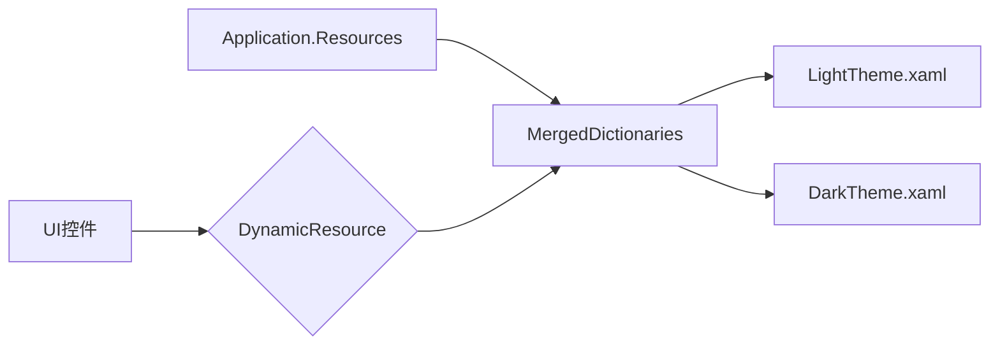

# 基于资源字典实现主题切换

> **核心原理**：WPF 的主题切换通过动态替换 `Application.Resources.MergedDictionaries` 中的资源字典实现。所有使用 `DynamicResource` 绑定的控件会自动更新。

---

## 📋 目录

- [[#核心原理]]
- [[#实现步骤]]
- [[#代码实现]]
- [[#关键要点]]
- [[#常见问题]]

---

## 🎯 核心原理

### 1. DynamicResource vs StaticResource

| 特性 | StaticResource | DynamicResource |
|------|----------------|-----------------|
| **查找时机** | 编译时/启动时查找一次 | 运行时持续监听资源变化 |
| **性能** | 更快 | 稍慢（需要运行时查找） |
| **主题切换** | ❌ 不支持 | ✅ 支持 |
| **使用场景** | 固定资源 | 可切换的主题资源 |

> **⚠️ 重要**：主题切换必须使用 `DynamicResource`，否则资源字典替换后控件不会更新。

### 2. 资源字典替换机制



**工作流程**：
1. 移除旧的主题资源字典
2. 加载新的主题资源字典
3. `DynamicResource` 自动重新查找资源
4. UI 自动更新

---

## 🛠️ 实现步骤

### 步骤 1：创建主题资源字典

创建两个资源字典文件，定义不同主题的颜色和样式：

**Themes/LightTheme.xaml**
```xml
<ResourceDictionary xmlns="...">
    <!-- 颜色定义 -->
    <Color x:Key="BackgroundColor">#FFFFFF</Color>
    <Color x:Key="ForegroundColor">#212121</Color>
    
    <!-- 画刷定义（使用 StaticResource，因为颜色在同一字典中） -->
    <SolidColorBrush x:Key="BackgroundBrush" Color="{StaticResource BackgroundColor}"/>
    <SolidColorBrush x:Key="ForegroundBrush" Color="{StaticResource ForegroundColor}"/>
    
    <!-- 隐式样式 -->
    <Style TargetType="Button">
        <Setter Property="Background" Value="{DynamicResource PrimaryBrush}"/>
    </Style>
</ResourceDictionary>
```

**Themes/DarkTheme.xaml**
```xml
<ResourceDictionary xmlns="...">
    <Color x:Key="BackgroundColor">#121212</Color>
    <Color x:Key="ForegroundColor">#FFFFFF</Color>
    <!-- ... -->
</ResourceDictionary>
```

> **💡 提示**：
> - 颜色定义在同一字典中，使用 `StaticResource`
> - 画刷和样式使用 `DynamicResource` 引用颜色
> - 隐式样式（无 `x:Key`）会自动应用到所有对应类型的控件

### 步骤 2：实现主题切换服务

**Services/ThemeService.cs**
```csharp
public static class ThemeService
{
    public static void SwitchTheme(string themeName)
    {
        var app = Application.Current;
        if (app?.Resources is not ResourceDictionary rootResources) return;
        
        // 移除现有的主题资源字典
        var themesToRemove = rootResources.MergedDictionaries
            .Where(d => d.Source?.OriginalString.Contains("Theme.xaml") == true)
            .ToList();
        
        foreach (var theme in themesToRemove)
        {
            rootResources.MergedDictionaries.Remove(theme);
        }
        
        // 加载新主题
        var assemblyName = System.Reflection.Assembly.GetExecutingAssembly().GetName().Name;
        var newTheme = new ResourceDictionary
        {
            Source = new System.Uri($"/{assemblyName};component/Themes/{themeName}Theme.xaml", 
                                    System.UriKind.Relative)
        };
        
        rootResources.MergedDictionaries.Add(newTheme);
    }
}
```

**关键点**：
- ✅ 使用 `component` URI 格式加载嵌入资源
- ✅ 通过文件名识别主题资源字典（包含 "Theme.xaml"）
- ✅ WPF 的 `DynamicResource` 会自动更新，无需手动刷新

### 步骤 3：在 XAML 中使用 DynamicResource

**MainWindow.xaml**
```xml
<Window Background="{DynamicResource BackgroundBrush}">
    <Button Content="切换主题" 
            Background="{DynamicResource PrimaryBrush}"/>
</Window>
```

**所有需要主题化的属性都必须使用 `DynamicResource`**：
- `Background`
- `Foreground`
- `BorderBrush`
- 样式中的 `Setter.Value`

### 步骤 4：绑定主题切换命令

**MainViewModel.cs**
```csharp
public partial class MainViewModel : ObservableObject
{
    [ObservableProperty]
    private string _themeButtonText = "切换到深色主题";
    
    [RelayCommand]
    private void ToggleTheme()
    {
        if (ThemeService.GetCurrentTheme() == "Light")
        {
            ThemeService.SwitchTheme("Dark");
            ThemeButtonText = "切换到浅色主题";
        }
        else
        {
            ThemeService.SwitchTheme("Light");
            ThemeButtonText = "切换到深色主题";
        }
    }
}
```

---

## 📝 完整代码实现

### ThemeService.cs

```csharp
using System.Linq;
using System.Windows;

namespace ColorSwitchSolution.Services;

/// <summary>
/// 主题切换服务：通过动态替换资源字典实现主题切换
/// </summary>
public static class ThemeService
{
    /// <summary>
    /// 切换主题
    /// </summary>
    /// <param name="themeName">主题名称（Light 或 Dark）</param>
    public static void SwitchTheme(string themeName)
    {
        var app = Application.Current;
        if (app?.Resources is not ResourceDictionary rootResources) return;
        
        // 移除现有的主题资源字典
        var themesToRemove = rootResources.MergedDictionaries
            .Where(d => d.Source?.OriginalString.Contains("Theme.xaml") == true)
            .ToList();
        
        foreach (var theme in themesToRemove)
        {
            rootResources.MergedDictionaries.Remove(theme);
        }
        
        // 加载新主题
        var assemblyName = System.Reflection.Assembly.GetExecutingAssembly().GetName().Name;
        var newTheme = new ResourceDictionary
        {
            Source = new System.Uri($"/{assemblyName};component/Themes/{themeName}Theme.xaml", 
                                    System.UriKind.Relative)
        };
        
        rootResources.MergedDictionaries.Add(newTheme);
    }
    
    /// <summary>
    /// 获取当前主题名称
    /// </summary>
    public static string GetCurrentTheme()
    {
        var app = Application.Current;
        if (app?.Resources is not ResourceDictionary rootResources) return "Light";
        
        var currentTheme = rootResources.MergedDictionaries
            .FirstOrDefault(d => d.Source?.OriginalString.Contains("Theme.xaml") == true);
        
        if (currentTheme?.Source?.OriginalString.Contains("DarkTheme") == true)
            return "Dark";
        
        return "Light";
    }
}
```

### App.xaml（加载默认主题）

```xml
<Application x:Class="ColorSwitchSolution.App"
             StartupUri="MainWindow.xaml">
    <Application.Resources>
        <ResourceDictionary>
            <ResourceDictionary.MergedDictionaries>
                <!-- 默认加载浅色主题 -->
                <ResourceDictionary Source="/ColorSwitchSolution;component/Themes/LightTheme.xaml"/>
            </ResourceDictionary.MergedDictionaries>
        </ResourceDictionary>
    </Application.Resources>
</Application>
```

---

## 🔑 关键要点

### ✅ 必须使用 DynamicResource

```xml
<!-- ✅ 正确：支持主题切换 -->
<Button Background="{DynamicResource PrimaryBrush}"/>

<!-- ❌ 错误：不支持主题切换 -->
<Button Background="{StaticResource PrimaryBrush}"/>
```

### ✅ 资源字典中的资源引用

```xml
<!-- 颜色在同一字典中，使用 StaticResource -->
<Color x:Key="BackgroundColor">#FFFFFF</Color>
<SolidColorBrush x:Key="BackgroundBrush" 
                 Color="{StaticResource BackgroundColor}"/>

<!-- 样式引用画刷，使用 DynamicResource -->
<Style TargetType="Button">
    <Setter Property="Background" Value="{DynamicResource PrimaryBrush}"/>
</Style>
```

### ✅ 隐式样式自动应用

```xml
<!-- 无 x:Key 的样式会自动应用到所有 Button -->
<Style TargetType="Button">
    <Setter Property="Background" Value="{DynamicResource PrimaryBrush}"/>
</Style>
```

### ✅ 资源 URI 格式

```csharp
// 标准格式：/AssemblyName;component/Path/File.xaml
Source = new Uri($"/{assemblyName};component/Themes/{themeName}Theme.xaml", 
                 UriKind.Relative)
```

---

## ❓ 常见问题

### Q1: 主题切换后控件没有更新？

**原因**：使用了 `StaticResource` 而不是 `DynamicResource`

**解决**：将所有主题相关的资源绑定改为 `DynamicResource`

### Q2: 资源字典加载失败？

**原因**：URI 路径不正确

**解决**：
- 确保使用 `/AssemblyName;component/Path/File.xaml` 格式
- 确保资源文件设置为 `Resource` 或 `Page` 生成操作

### Q3: TabControl 等控件不受主题影响？

**原因**：控件使用了默认模板，没有应用主题样式

**解决**：在主题资源字典中定义隐式样式，覆盖控件的默认模板

```xml
<Style TargetType="TabItem">
    <Setter Property="Template">
        <Setter.Value>
            <ControlTemplate TargetType="TabItem">
                <!-- 自定义模板，使用 DynamicResource -->
            </ControlTemplate>
        </Setter.Value>
    </Setter>
</Style>
```

### Q4: 性能问题？

**原因**：`DynamicResource` 需要运行时查找，比 `StaticResource` 稍慢

**解决**：
- 只在需要主题切换的资源上使用 `DynamicResource`
- 固定资源（如颜色定义）使用 `StaticResource`

---

## 📚 相关链接

- [[WPF资源系统]]
- [[DynamicResource与StaticResource]]
- [[ResourceDictionary使用]]

---

## 🎨 最佳实践

1. **统一命名**：主题文件使用统一的命名规范（如 `LightTheme.xaml`、`DarkTheme.xaml`）
2. **资源层次**：颜色 → 画刷 → 样式，逐层引用
3. **隐式样式**：使用隐式样式统一控件外观
4. **测试覆盖**：确保所有页面和控件在主题切换后正常显示

---

